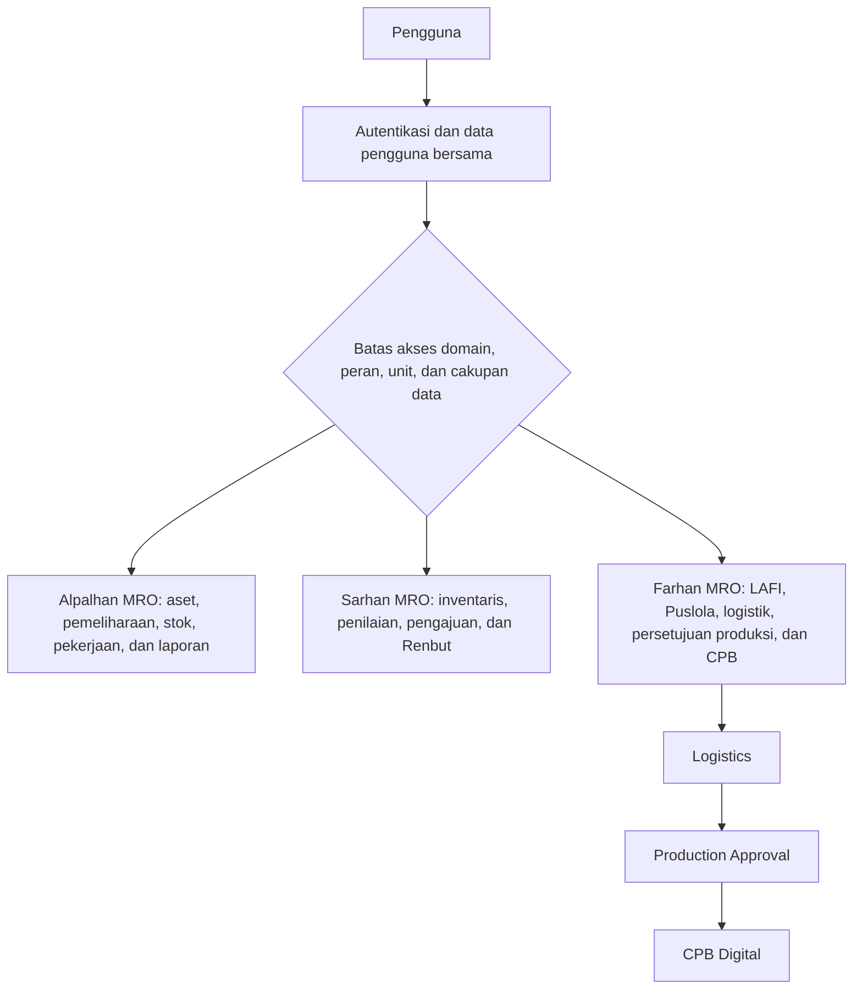

# Handover Backend MRO

## Tujuan dan Sasaran Pembaca

Paket ini membantu **pengembang backend pengganti** memahami tujuan produk, batas domain, aktor, kebutuhan, aturan, data, status, serta proses bisnis pada aplikasi. Bahasa dan ringkasannya juga ditujukan agar pemilik proses dan pembaca nonteknis dapat mengikuti alur tanpa harus membaca kode terlebih dahulu.

Dokumen ini bukan pengganti kode. Gunakan dokumen untuk menemukan perilaku dan sumber terkait, lalu cocokkan keputusan perubahan dengan implementasi aktif dan pengujian yang relevan.

## Snapshot Dokumentasi

- **Tanggal snapshot:** 15 Juli 2026.
- Sumber kebenaran snapshot adalah **current working tree**, termasuk perubahan yang belum di-commit pada saat dokumen disusun.
- Snapshot ini **tidak diperbarui secara otomatis** ketika kode berubah setelah tanggal tersebut. Selalu periksa working tree terbaru sebelum mengubah perilaku.
- Paket hanya menjelaskan perilaku yang ditemukan; nilai konfigurasi dan kredensial sensitif tidak dicantumkan.

## Arsitektur dan Batas Domain

Aplikasi adalah satu **monolit Laravel**: autentikasi dan model pengguna dipakai bersama, sedangkan aturan peran, unit, cakupan data, serta workflow diterapkan oleh masing-masing domain. Login bersama tidak berarti seorang pengguna otomatis berhak mengakses atau bertindak di semua domain.

Tiga domain kanonis dalam paket ini adalah **Alpalhan MRO**, **Sarhan MRO**, dan **Farhan MRO**. Nama **Alpalhan MRO** wajib dipakai sebagai nama domain. **Alpal** adalah nama pendek/varian yang masih dapat muncul pada kode atau antarmuka, sedangkan **Alpalhankam** adalah istilah badan/data untuk alat peralatan pertahanan dan keamanan; keduanya bukan domain keempat.

Dalam bahasa sederhana, satu pintu login melayani aplikasi yang sama, tetapi setiap cabang mempunyai pemilik proses dan pengaman sendiri. Alpalhan dan Sarhan menangani rantai MRO sesuai objek bisnisnya. Farhan mempunyai rantai internal yang lebih rapat: kesiapan bahan pada Logistics diteruskan ke Production Approval, kemudian hasil persetujuan menjadi gerbang CPB Digital. Diagram menunjukkan batas dan arah serah-terima, bukan menyatakan bahwa seluruh pengguna, data, atau status dapat berpindah antardomain.

## Indeks Dokumen

### Alpalhan MRO

- [PRD Alpalhan MRO](./alpalhan/PRD.md) — peta produk alat peralatan pertahanan dan keamanan yang mencakup konfigurasi aset/BOM, preventive maintenance, pengajuan harwat, pemisahan SPK atau Renbut berdasarkan stok, WO/checklist Bengkel, inspeksi, RHI, dan laporan. Dokumen membedakan transaksi basis data dari panel demo, fallback, kontrol, atau angka asumsi.
- [Proses Bisnis Alpalhan MRO](./alpalhan/BUSINESS-PROCESS.md) — langkah operasional dari aset dan pengajuan menuju SPK/WO atau Renbut, mutasi stok, pelaksanaan checklist, laporan harian, dan analitik. Alur persetujuan dan status WO dijelaskan sebagai perilaku yang tersebar, termasuk gap akses, dead route, dan transisi yang belum ditegakkan sebagai state machine ketat.

### Sarhan MRO

- [PRD Sarhan MRO](./sarhan/PRD.md) — kebutuhan pengelolaan sarana-prasarana: organisasi, inventaris, penilaian risiko, pengajuan dan versi RAB, verifikasi Operator–Kotama–Mabes–Pusat, Renbut, impor/ekspor, berkas, dan administrasi pengguna. Risiko scope objek, data tampilan tetap/acak, hard delete, serta replacement impor AU ditandai jelas.
- [Proses Bisnis Sarhan MRO](./sarhan/BUSINESS-PROCESS.md) — urutan registrasi dan penilaian aset, pengajuan berjenjang, revisi/penolakan, materialisasi RAB ke Renbut, impor Excel AU, ekspor, dan administrasi akun. Matriksnya menunjukkan siapa dapat melihat atau bertindak serta di mana pembatasan organisasi belum efektif.

### Farhan MRO

- [PRD Farhan MRO](./farhan/PRD.md) — kebutuhan lima area Farhan dan hubungan statusnya: operasi unit LAFI, koordinasi Puslola, persediaan Logistics, Production Approval berversi, serta pelaksanaan CPB Digital. Dokumen menyoroti dua jalur persetujuan yang koeksis, keputusan Kabadan di luar sistem, dan implementasi Production Approval yang masih WIP pada working tree.
- [Proses Bisnis Farhan MRO](./farhan/BUSINESS-PROCESS.md) — alur instruksi, usulan, koreksi, bundel, keputusan/revisi, alokasi dan konsumsi stok, bootstrap CPB, tahap produksi/mutu, finalisasi, serta pelepasan obat jadi. Status instruksi, usulan, bundel, pelaksanaan, mutu, item revisi, dan CPB sengaja tidak digabungkan.

## Lima Area Farhan

1. **LAFI** — workspace unit pelaksana untuk inventaris, personel, logistik, perizinan, produksi, QC/QA, kegiatan, dan laporan; Kalafi menyusun usulan dan operator menjalankan batch.
2. **Puslola** — workspace pengawasan dan koordinasi lintas unit untuk monitoring, distribusi, perizinan, mutu, instruksi, pemeriksaan usulan, bundel, dan pencatatan keputusan.
3. **Logistics** — penerimaan dan mutu BBO, persediaan agregat/batch, alokasi, konsumsi, ledger pergerakan, pengiriman, serta pelepasan obat jadi. Alokasi menambah ketersediaan; konsumsi baru terjadi ketika batch dimulai.
4. **Production Approval** — instruksi, usulan, koreksi, bundel berversi, revisi/penolakan/pembatalan, keputusan langsung atau off-system, surat final, audit, notifikasi, alokasi, dan gerbang menuju pelaksanaan.
5. **CPB Digital** — Catatan Pengolahan Batch digital dari templat, tahap produksi dan QC, QA, rekonsiliasi, tanda tangan, reopen terbatas sebelum final, finalisasi terminal, dan hubungan ke obat jadi.

Kelima area bukan aplikasi terpisah. Tanggung jawab utama berpindah **LAFI ↔ Puslola**, sedangkan data operasional mengalir pada rantai **Logistics → Production Approval → CPB Digital → Logistics/monitoring Puslola**.

## Legenda Status Dokumentasi dan Maturitas

| Label | Arti saat membaca paket |
|---|---|
| **Terimplementasi** | Jalur aktif ditemukan dan perilakunya didukung kode atau pengujian. Label ini tidak menghapus batas akses, dependensi, atau kasus gagal yang dicatat. |
| **WIP** | Implementasi tersedia sebagian, bercampur data presentasi, belum tersambung penuh, belum lengkap pengamannya, atau masih berupa perubahan working tree. |
| **Belum pasti** | Bukti aktif belum cukup untuk memastikan aturan, pelaku, atau maksud bisnis; perlu konfirmasi pemilik proses. |

Alpalhan juga memakai penjelas maturitas yang lebih rinci:

- **Terimplementasi dengan dependensi / dependensi eksternal**: jalur aktif, tetapi hasil bergantung pada sistem di luar monolit.
- **Terimplementasi dengan gap**: transaksi utama aktif, tetapi ada bagian alur, akses, atau konsistensi yang belum lengkap.
- **WIP/campuran**: satu tampilan menggabungkan data transaksi dengan data demo, fallback, kontrol, statis, acak, atau asumsi.
- **WIP/derived view**: hasil merupakan turunan atau presentasi, bukan master data otoritatif.
- **WIP/distributed behavior**: perilaku ada pada beberapa controller/service, tetapi bukan state machine ujung-ke-ujung yang ditegakkan secara terpusat.

Label maturitas menjelaskan kekuatan bukti pada snapshot, bukan komitmen penyelesaian atau urutan prioritas pekerjaan.

## Cara Membaca Paket

1. **Mulai dari PRD domain.** Baca ringkasan, cakupan/non-cakupan, aktor, inventaris fitur, aturan, data utama, kegagalan, dan bagian WIP. PRD menjawab “apa yang sistem lakukan, untuk siapa, dan dengan batas apa”.
2. **Ikuti ID kebutuhan dan penerimaan.** ID `FR` (*functional requirement*) menandai perilaku yang dapat diamati; ID `AC` (*acceptance criterion*) menandai hasil terukur untuk membuktikannya. Prefix `ALP`, `SAR`, atau `FAR` menunjukkan domain, sedangkan segmen tengah menunjukkan submodul, misalnya `FAR-CPB-FR-001`.
3. **Buka dokumen Proses Bisnis.** Dokumen ini menjawab “bagaimana pekerjaan bergerak” melalui prasyarat, langkah bernomor, jalur normal, revisi, penolakan, pembatalan, pengajuan ulang, atau pengecualian yang benar-benar tersedia.
4. **Gunakan matriks peran–aktivitas.** Cocokkan aktor dengan hak melihat, hak bertindak, status prasyarat, serta batas unit/matra. Nama peran yang mirip antardomain tidak otomatis mempunyai kewenangan yang sama.
5. **Gunakan matriks transisi status.** Baca status asal, pemicu, aktor, syarat, status tujuan, dan efek samping sebagai satu kesatuan. Jangan menyamakan status dari entitas berbeda, terutama pada Farhan.
6. **Baca diagram Mermaid bersama narasinya.** Diagram adalah peta cepat arah alur; penjelasan setelah diagram menerangkan makna bisnis dan pengecualian. Bila diagram dan asumsi pembaca berbeda, matriks, narasi, serta bukti kode harus diperiksa bersama.
7. **Telusuri referensi sumber.** Path repository dalam tanda backtick menunjuk route, middleware, controller, request, service, model, enum, migration, view, atau test yang mendukung klaim. Referensi adalah titik awal verifikasi terhadap working tree terbaru, bukan jaminan bahwa nomor baris atau implementasi tidak berubah.

## Batas dan Serah-Terima Lintas Domain

- Autentikasi dan data pengguna adalah dependensi bersama; peran, unit, badan, scope objek, serta status workflow tetap milik domain masing-masing.
- Ketiga domain berada dalam monolit dan dapat memakai infrastruktur aplikasi yang sama, tetapi dokumentasi tidak menemukan satu workflow bisnis global yang menyatukan Alpalhan, Sarhan, dan Farhan.
- Serah-terima terperinci yang paling kuat terjadi **di dalam Farhan**, bukan antar-tiga domain: LAFI dan Puslola bertukar instruksi/usulan/revisi, sedangkan Logistics, Production Approval, dan CPB Digital bertukar stok, persetujuan, pelaksanaan, dan hasil jadi.
- Renbut, aset, stok, persetujuan, dan istilah “selesai” dapat mempunyai arti berbeda di setiap domain. Jangan memindahkan aturan atau status hanya karena namanya serupa.

## Peringatan Penggunaan

Jangan memperlakukan **WIP**, **Belum pasti**, data demo/fallback, route mati, kode tidak terjangkau, atau keputusan off-system sebagai perilaku yang dijanjikan. Jangan pula mengubah gap yang terdokumentasi menjadi aturan bisnis tanpa konfirmasi dan bukti implementasi. Sebelum memperbaiki atau memperluas fitur, cocokkan PRD, proses bisnis, matriks, diagram, referensi sumber, dan pengujian pada working tree terbaru.
