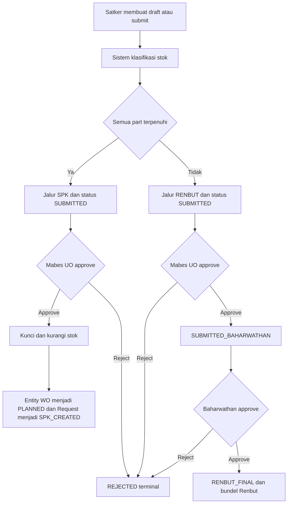
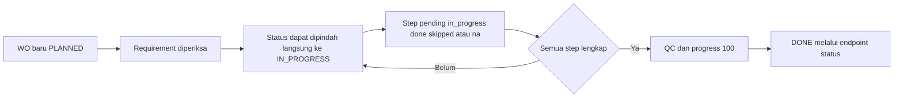
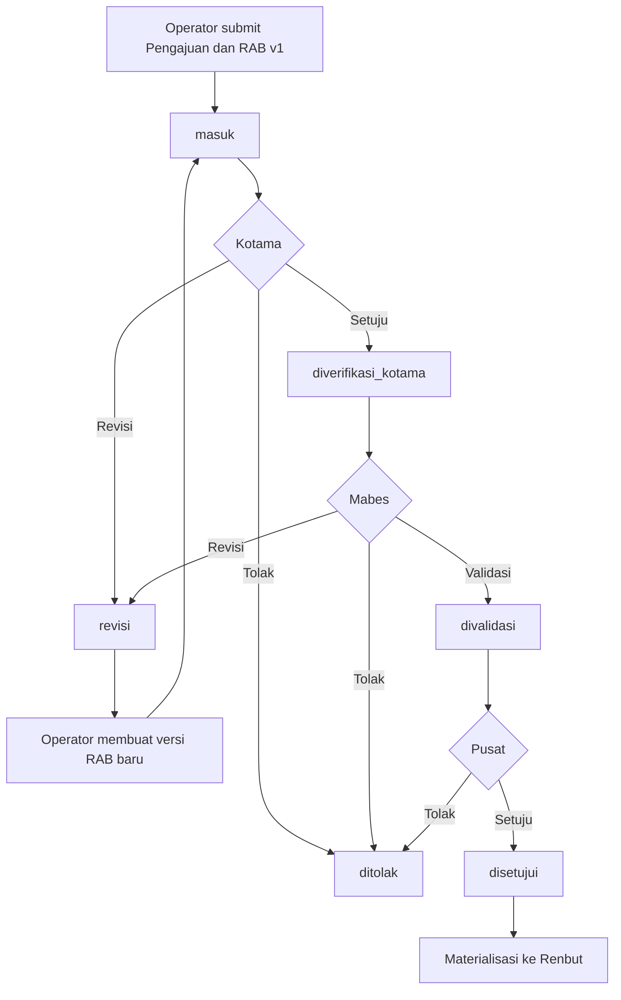
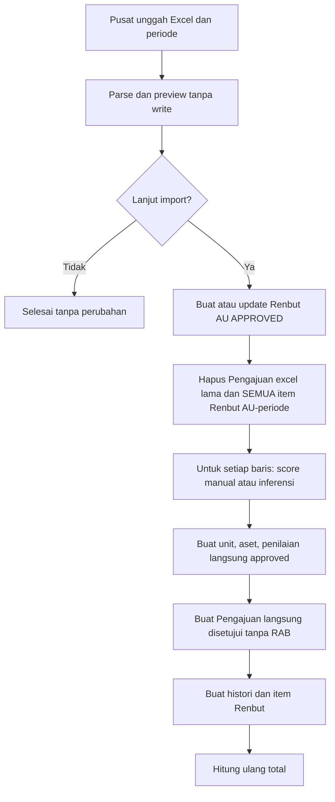
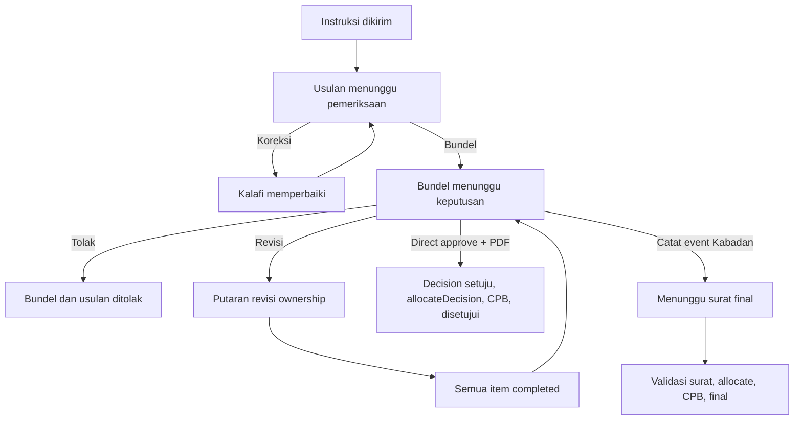
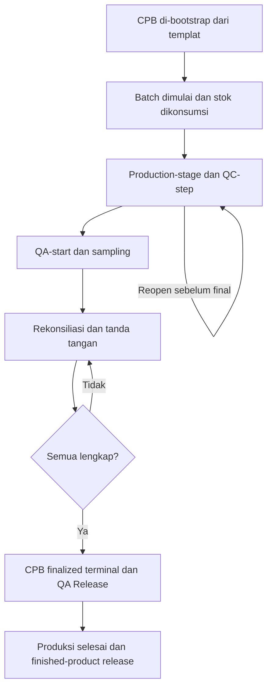
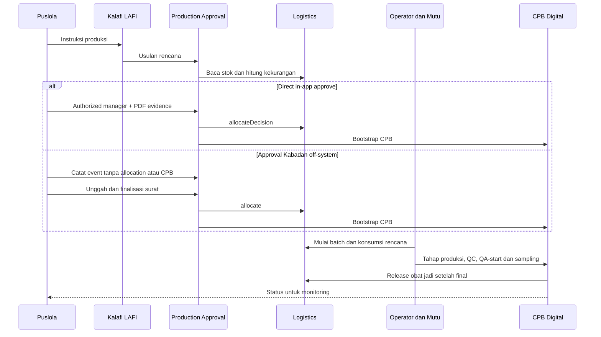

# Proses Bisnis — Sysinfo Harwat (Backend MRO)

Dokumen ini menjabarkan proses bisnis terpadu dari tiga domain MRO: **Alpalhan**, **Sarhan**, dan **Farhan**. Kebutuhan dan kriteria penerimaan tersedia pada [PRD Sysinfo Harwat](./PRD.md). Snapshot working tree 15 Juli 2026.

---

# Domain 1: Alpalhan MRO

Nama kanonis adalah **Alpalhan MRO**; **Alpal** merupakan nama pendek, sedangkan **Alpalhankam** adalah istilah badan/data, bukan domain lain.

## Ikhtisar

Konvensi bisnis menghubungkan ACM (konfigurasi aset) → preventive atau pengajuan MMS → pemeriksaan stok → SPK/WO di Bengkel atau Renbut → inspeksi/laporan → RHI/report. Akan tetapi, MMS → approval → SPK/Renbut adalah perilaku yang tersebar di method controller/service, **bukan state machine ujung-ke-ujung yang stabil dan enforced**. Transaksi inti tersimpan pada fleet, BOM, pengajuan, stok, Renbut, WO/checklist, dan laporan AL. Hanya bagian presentasi tertentu yang demo/fallback.

## Aktor dan Tanggung Jawab

- **Satker:** memilih aset, mencatat kebutuhan, menyimpan draft/submit, dan memasukkan laporan.
- **Mabes UO/Strategis:** nilai role `strategis` dipetakan ke jalur bisnis Mabes/UO; memeriksa `SUBMITTED` dalam matra sama.
- **Baharwathan/Inspektorat:** nilai role `inspektorat` dipetakan ke jalur final berlabel Baharwathan.
- **Pemelihara/Depo/Teknisi:** menyiapkan fasilitas, requirement, pekerjaan, dan progress WO.
- **Petugas gudang:** receipt/issue stok.
- **Inspektur/QC:** konsep bisnis pada tahap QC/checklist, tetapi tidak ada guard atau aksi penolakan QC yang terkonfirmasi.
- **Sistem:** klasifikasi stok, pengurangan saldo, pembuatan kode/record, perhitungan kesiapan/RHI/report.
- **Layanan chatbot eksternal:** memproses chat, sesi, dan halaman manual; aplikasi memproxy sesi.

## Prasyarat dan Hasil

| Proses | Prasyarat | Hasil |
|---|---|---|
| ACM/import | Login; workbook/form valid | Fleet dan BOM tersimpan. |
| Preventive | Fleet, BOM, template aktif, fasilitas aktif sematra | WO `PLANNED`, snapshot, requirement dan step. |
| Pengajuan MMS | Satker, fleet, input valid | Draft/submitted, parts, klasifikasi jalur, timeline. |
| Jalur SPK | `SUBMITTED`, stok cukup saat approval, Mabes sematra | Stok turun; satu WO `PLANNED`; request `SPK_CREATED`. |
| Jalur Renbut | `SUBMITTED`, stok kurang/kosong | `SUBMITTED_BAHARWATHAN`, lalu `RENBUT_FINAL` dan bundel Renbut. |
| WO/checklist | WO ada; status sesuai | Progress/status/checker tersimpan. |
| Laporan AL | Fleet AL dan JSON entry | Laphar/entry tersimpan; kondisi BOM disinkronkan. |
| Analitik | Data operasional tersedia atau fallback dipakai | Tampilan campuran. |

## Proses Utama per Submodul

### Dashboard (`ALP-DASH-FR-001`)

1. Pengguna membuka dashboard.
2. Sistem menentukan scope matra.
3. Sistem menghitung fleet/WO/timeline basis data.
4. Sistem menambahkan modifier, WO, aset, koordinat, atau klasifikasi demo.
5. UI menampilkan readiness, daftar aset, alert, dan peta. Hasil bukan laporan resmi murni.

### ACM, BOM, technical library, dan import (`ALP-ACM-FR-001..003`)

1. Pengguna membuka daftar fleet yang di-scope matra.
2. Untuk import, pengguna mengunggah Excel; parser membaca identitas, metadata, status, dan struktur SYS–ASSY–PART.
3. Dalam transaksi, sistem menyimpan fleet dan node BOM rekursif.
4. Detail mengambil fleet/BOM serta task preventive. Galeri, logbook, workorder, Renbut tertentu dibuat saat request sebagai demo/fallback.
5. Technical Library sepenuhnya array statis.

### Preventive maintenance (`ALP-PM-FR-001`)

1. Sistem mengambil task template aktif, node BOM dan fleet.
2. UI menampilkan proyeksi `REAL` dan `SIM`.
3. Pengguna memilih task, tingkat, prioritas, fasilitas, dan jadwal.
4. Controller memastikan template terkait fleet, fasilitas aktif dan sematra, serta matra user cocok.
5. Sistem membuat WO `PLANNED`, snapshot task, requirement dan step `pending`.

### Chatbot (`ALP-CHAT-FR-001`)

1. UI memeriksa health/suggestions.
2. Pengguna mengirim pesan yang tervalidasi.
3. Aplikasi memproxy ke layanan eksternal.
4. Jika gagal, status unavailable.

### MMS pengajuan dan pemisahan jalur (`ALP-MMS-FR-001..003`)

1. Satker memilih fleet, kategori, tingkat, prioritas, periode, deskripsi, dan parts.
2. Sistem membaca stok, menghitung estimasi, memilih `SPK` atau `RENBUT`.
3. Satker menyimpan `DRAFT` atau langsung `SUBMITTED`.
4. Mabes UO sematra memeriksa `SUBMITTED`.
5. Jika jalur SPK disetujui: transaksi lock/pengurangan stok, entity WO `PLANNED`, entity Request `SPK_CREATED`.
6. Jika jalur Renbut disetujui: request menjadi `SUBMITTED_BAHARWATHAN`.
7. Penolakan menghasilkan `REJECTED`; tidak ada edit/resubmit aktif.

### Renbut (`ALP-REN-FR-001..002`)

1. Baharwathan menerima request jalur Renbut berstatus `SUBMITTED_BAHARWATHAN`.
2. Saat approve, sistem mencari/membuat Renbut berdasarkan matra dan periode `APPROVED`.
3. Sistem mengaitkan request, menetapkan `RENBUT_FINAL`, menghitung ulang total.
4. Halaman Renbut hanya menampilkan request final.
5. Route create/store langsung tidak aktif. Dead route `POST /renbut/{id}/status`.

### Bengkel, WO, dan checklist (`ALP-WO-FR-001`)

1. Board menampilkan fasilitas aktif dan WO; board kosong memakai WO demo.
2. Saat `PLANNED`, requirement dapat berubah.
3. Status WO dapat dipindahkan langsung oleh endpoint tanpa memeriksa asal.
4. Saat `IN_PROGRESS`, step dapat dicatat.
5. Rasio step selesai menghitung progress; 100% → `QC`.
6. `DONE` reversible. Revisi, pembatalan, QC rejection tidak evidenced.

### Stok (`ALP-STK-FR-001`)

1. Receipt/issue langsung memutasi saldo; issue menolak kekurangan.
2. Pada penerbitan SPK, service memakai row lock di dalam transaksi.
3. Tidak ada general ledger.

### Personel (`ALP-PER-FR-001`)

1. Beban diturunkan dari teks teknisi WO; matrix diturunkan dari template.
2. Output adalah **derived view**, bukan master data authoritative.

### RHI (`ALP-RHI-FR-001`)

1. Feature middleware menolak `pm_demo`.
2. Controller menggabungkan data operasional dengan data kontrol.

### Inspeksi dan laporan harian (`ALP-INSP-FR-001..002`)

1. Lapkonis/kepatuhan: cadence AL Senin/Kamis, matra lain harian.
2. AL: validasi JSON, simpan laphar/entry, sinkronkan BOM dalam transaksi.
3. `storeAu()` dan `storeAd()` hanya mock redirect.

### Reports (`ALP-RPT-FR-001`)

1. Sistem menghitung ringkasan WO/kesiapan/biaya dari DB.
2. Juga menghasilkan MTBF/MTTR acak, anggaran asumsi.

## Matriks Transisi Status

### Pengajuan Harwat

| Asal | Tindakan | Aktor | Tujuan | Efek samping |
|---|---|---|---|---|
| Baru | Simpan draft | Satker | `DRAFT` | Parts, biaya, timeline. |
| Baru | Submit langsung | Satker | `SUBMITTED` | Jalur/status stok ditentukan. |
| `DRAFT` | `submit` | Satker pemilik | `SUBMITTED` | Timeline. |
| `SUBMITTED` | approve jalur SPK | Strategis sematra | `SPK_CREATED` + WO `PLANNED` | Stok turun. |
| `SUBMITTED` | approve jalur Renbut | Strategis sematra | `SUBMITTED_BAHARWATHAN` | Timeline. |
| `SUBMITTED` | reject | Strategis sematra | `REJECTED` | Alasan. |
| `SUBMITTED_BAHARWATHAN` | approve | Inspektorat | `RENBUT_FINAL` | Renbut dibuat/dikaitkan. |
| `SUBMITTED_BAHARWATHAN` | reject | Inspektorat | `REJECTED` | Alasan. |

### Work Order

| Asal | Pemicu | Tujuan | Catatan |
|---|---|---|---|
| Baru | Create dari request/preventive | `PLANNED` | WO/checklist dibuat. |
| `BACKLOG`/`PLANNED` | Progress > 0 | `IN_PROGRESS` | Progress tersimpan. |
| Apapun | Progress = 100 atau semua step | `QC` | Progress 100. |
| Status apa pun | POST status | Status apa pun dari 5 status | Controller tidak membatasi pasangan asal-tujuan. |

### Checklist

| Jenis | Status yang diterima | Gerbang update |
|---|---|---|
| Requirement | `pending`, `ready`, `issued`, `not_available`, `returned` | WO harus `PLANNED` |
| Step | `pending`, `in_progress`, `done`, `skipped`, `na` | WO harus `IN_PROGRESS` |

## Diagram Mermaid

### Pengajuan, stok, SPK, dan Renbut

### Pelaksanaan WO dan checklist

## Pengecualian dan Kasus Khusus

1. User login dari badan lain tidak diblokir oleh grup route Alpalhan.
2. Penghapusan pengajuan tidak memeriksa ownership.
3. `UpdatePengajuanHarwatRequest` adalah scaffold tidak terjangkau.
4. Dead route `POST /renbut/{id}/status`.
5. Stok dapat berubah antara submit dan approve; service memeriksa ulang.
6. Endpoint status WO dapat melompati tahap atau kembali.
7. Form Request `authorize()` selalu true untuk requirement/step.
8. `storeAu()`/`storeAd()` hanya mock redirect.
9. Revisi, pembatalan, reopening, QC rejection, final acceptance tidak evidenced.

## Referensi Sumber

- Route dan akses: `routes/web.php`, `app/Http/Middleware/AlpalhanFeature.php`, `app/Models/User.php`.
- ACM/import: `app/Http/Controllers/AlpalhanMro/AcmListAsetController.php`, `app/Services/AlpalhanMro/LapkonisExcelParser.php`.
- Pengajuan/Renbut/stok: `app/Http/Controllers/AlpalhanMro/MmsPengajuanHarwatController.php`, `app/Http/Controllers/AlpalhanMro/RenbutController.php`, `app/Services/AlpalhanMro/AlpalhanStockIssueService.php`.
- WO/Bengkel: `app/Http/Controllers/AlpalhanMro/BengkelController.php`, `app/Http/Controllers/AlpalhanMro/BengkelGudangController.php`.
- RHI/inspeksi/report: `app/Http/Controllers/AlpalhanMro/RhiController.php`, `app/Http/Controllers/AlpalhanMro/InspeksiLaporanHarianController.php`, `app/Http/Controllers/AlpalhanMro/ReportsController.php`.
- Pengujian: `tests/Feature/AlpalhanMro/PengajuanHarwatWorkflowTest.php`, `tests/Feature/AlpalhanMro/PreventiveMaintenanceControllerTest.php`, `tests/Feature/AlpalhanMro/BengkelLogistikSectionTest.php`.

---

# Domain 2: Sarhan MRO

## Ikhtisar

Proses Sarhan MRO dibagi menjadi enam rangkaian utama:

1. akses berdasarkan badan, peran, matra, dan unit organisasi;
2. registrasi inventaris dan pemetaan aset ke struktur organisasi;
3. penilaian aset oleh Kotama dengan skor kemungkinan, dampak, risiko, dan prioritas;
4. pengajuan pemeliharaan dan RAB dari Operator melalui Kotama, Mabes, dan Pusat;
5. pembentukan Renbut melalui persetujuan normal atau impor Excel khusus AU, lalu ekspor dokumen; dan
6. administrasi akun oleh Pusat.

**Satker** adalah satuan kerja pelaksana. **Kotama** adalah komando utama yang menaungi Satker. **RAB** adalah rincian volume, harga satuan, dan total biaya. **Materialisasi** berarti menyalin data pengajuan/RAB yang disetujui menjadi baris Renbut.

## Aktor dan Tanggung Jawab

| Aktor | Memulai | Memeriksa/mengubah | Memutuskan | Menerima hasil |
|---|---|---|---|---|
| Operator | aset, Pengajuan, RAB, lampiran, kirim ulang revisi | RAB miliknya hanya pada `revisi` | hard delete tersedia tanpa guard | revisi/penolakan dan histori |
| Kotama | tidak membuat pengajuan | aset/RAB pada antrean | setuju/revisi/tolak penilaian dan pengajuan | dashboard organisasi, exercise |
| Mabes | tidak membuat pengajuan | RAB setelah Kotama | validasi/revisi/tolak | Renbut dan ekspor matranya |
| Pusat | impor Excel AU, akun pengguna | RAB setelah Mabes | setuju/tolak akhir | Renbut semua matra dan ekspor |
| Super Admin | entry point lintas badan/peran | data yang tidak discope | melewati middleware | tampilan/hasil sesuai method |

## Proses Utama per Submodul

### 1. Akses, badan, peran, dan organisasi (`SAR-ACC`)

1. Pengguna login melalui autentikasi bersama.
2. Root memeriksa badan. Operator → inventaris; peran lain → dashboard.
3. Group route memeriksa `Sarhan`, lalu `SarhanRole` tanpa parameter hanya memastikan `role` non-null.
4. Endpoint role-spesifik memeriksa daftar role yang diizinkan.

### 2. Dashboard, analytics, dan master (`SAR-DASH`, `SAR-ANL`, `SAR-MST`)

1. Operator dialihkan ke inventaris.
2. Kotama menerima dashboard khusus organisasinya.
3. Mabes/Pusat menerima dashboard umum.
4. Analytics menyajikan matriks dampak × kemungkinan dan prioritas P1/P2/P3.
5. Data dashboard umum dan analytics tidak seluruhnya dari database; master sepenuhnya array tetap.

### 3. Registrasi inventaris dan organisasi (`SAR-INV`)

1. Operator memilih jalur unit organisasi dan kategori Sarhan.
2. Sistem memetakan kondisi LF/RR/RS/RB/TED menjadi skor kemungkinan awal 1–5.
3. Sistem menyimpan aset dan metadata dalam transaksi.
4. Sistem membuat penilaian `menunggu_penilaian_kotama`.
5. Update aset berstatus `revisi_satker` mengembalikan penilaian ke menunggu.

### 4. Penilaian aset Kotama (`SAR-ASMT`)

1. Kotama membuka antrean yang discope ke unit dan descendants.
2. Untuk setuju: empat skor 1–5, max dampak × kemungkinan, P1/P2/P3 (tanpa impact cap).
3. Alternatif: revisi `revisi_satker` atau tolak `ditolak_kotama` dengan catatan.

### 5. Pengajuan dan RAB berjenjang (`SAR-SUB`, `SAR-VER`)

1. Operator memilih aset, mengisi kategori, uraian, tahun, item RAB, dan lampiran.
2. Sistem membuat ID usulan, status `masuk`, RAB v1 aktif, relasi aset, lampiran, histori.
3. Kotama melihat `masuk`; dapat edit RAB, setujui, revisi, atau tolak.
4. Bila revisi, Operator pemilik mengedit RAB lalu kirim ulang ke `masuk`.
5. Mabes melihat `diverifikasi_kotama`; dapat edit RAB, validasi, revisi, atau tolak.
6. Pusat melihat `divalidasi`; dapat edit RAB, setujui, atau tolak.
7. Persetujuan Pusat membuat/mengambil Renbut matra-periode, materialisasi RAB, hitung total.

### 6. Renbut normal, impor AU, dan ekspor (`SAR-REN`)

**Jalur normal:** Persetujuan Pusat menentukan matra dari aset dan periode dari tahun anggaran. Item RAB aktif disalin menjadi item Renbut. Total dihitung ulang.

**Jalur impor Excel AU:**
1. Pusat mengunggah `.xlsx/.xls` untuk preview.
2. Auto-scorer memakai klasifikasi/kondisi manual atau inferensi. Algoritma memakai impact cap: dampak 3 max P2, dampak ≤2 max P3.
3. Saat import, semua item Renbut AU/periode (termasuk item manual-materialized) dihapus.
4. Tiap baris membuat unit, aset, penilaian langsung disetujui, pengajuan langsung disetujui, histori, dan item Renbut.
5. Pengajuan manual dipertahankan, tetapi itemnya tidak dibangun ulang.

**Ekspor:** PDF, Word, atau Excel per periode dan cakupan matra.

### 7. Administrasi pengguna dan berkas (`SAR-USR`, `SAR-FILE`)

1. Pusat mengelola akun Sarhan (CRUD).
2. Galeri aset dan lampiran pengajuan pada disk publik.
3. Object-level authorization target belum konsisten.

## Matriks Transisi Status

### Penilaian aset

| Asal | Tindakan | Aktor | Tujuan |
|---|---|---|---|
| tidak ada | registrasi aset | Operator | `menunggu_penilaian_kotama` |
| `menunggu_penilaian_kotama` | setujui | Kotama | `disetujui_kotama` |
| `menunggu_penilaian_kotama` | revisi | Kotama | `revisi_satker` |
| `revisi_satker` | update aset | Operator | `menunggu_penilaian_kotama` |
| `menunggu_penilaian_kotama` | tolak | Kotama | `ditolak_kotama` |

### Pengajuan

| Asal | Tindakan | Aktor | Tujuan | Efek |
|---|---|---|---|---|
| tidak ada | submit | Operator | `masuk` | Progres 0; RAB v1; histori |
| `masuk` | approve Kotama | Kotama | `diverifikasi_kotama` | Progres 40 |
| `masuk` | revisi | Kotama | `revisi` | Progres 25 |
| `revisi` | submit ulang | Operator pemilik | `masuk` | Progres 25 |
| `diverifikasi_kotama` | validasi | Mabes | `divalidasi` | Progres 60 |
| `diverifikasi_kotama` | revisi | Mabes | `revisi` | Progres 25 |
| `divalidasi` | approve | Pusat | `disetujui` | Progres 100; Renbut/item |
| tahap terkait | tolak | Reviewer | `ditolak` | Progres 0 |
| status apa pun | hard delete | Operator | record hilang | Renbut dapat yatim |

## Diagram Mermaid

### Pengajuan dan RAB berjenjang

### Impor Excel AU

## Pengecualian dan Kasus Khusus

1. **Kotama Pengajuan lintas organisasi:** scope tidak efektif.
2. **Direct asset detail:** tanpa scope Kotama.
3. **Lampiran dan hard delete Pengajuan:** tanpa owner/status check; Renbut approved dapat yatim.
4. **Impor risiko tinggi:** semua item manual dihapus dan tidak dibangun kembali.
5. **Budget/analytics WIP:** angka tetap atau acak.
6. **String-literal statuses:** tidak ada enum Sarhan tunggal.
7. **Mabes tanpa matra:** Renbut kosong.
8. **Tidak ada queue/scheduler:** semua sinkron.
9. **User target:** resource binding tanpa guard badan target.

## Referensi Sumber

- Route/akses: `routes/web.php`, `app/Http/Middleware/CheckBadan.php`, `app/Http/Middleware/SarhanRole.php`.
- Inventaris/penilaian: `app/Http/Controllers/SarhanMro/InventoryController.php`, `app/Http/Controllers/SarhanMro/PenilaianController.php`.
- Pengajuan/Renbut: `app/Http/Controllers/SarhanMro/PengajuanController.php`, `app/Http/Controllers/SarhanMro/RenbutController.php`, `app/Services/SarhanMro/SarhanRenbutExcelImporter.php`.
- Pengujian: `tests/Feature/SarhanMro/AsetRegistrationWorkflowTest.php`, `tests/Feature/SarhanMro/ExerciseWorkflowTest.php`, `tests/Feature/SarhanMro/RenbutExcelImportTest.php`.

---

# Domain 3: Farhan MRO

## Ikhtisar

Proses Farhan MRO dipisahkan menjadi **LAFI**, **Puslola**, **Logistics**, **Production Approval**, dan **CPB Digital**. Pemisahan ini penting: status instruksi, status persetujuan produksi, status pelaksanaan, status bundel, state item revisi, tipe keputusan, dan status mutu BBO adalah kosakata berbeda. Setelah bundel terbentuk, ada dua path: direct in-app approve oleh authorized manager dengan PDF evidence; atau pencatatan event Kabadan eksternal/off-system, menunggu surat final, lalu finalisasi.

Seluruh Production Approval berstatus **WIP** karena feature set berada pada working tree yang belum di-commit.

## Aktor dan Tanggung Jawab

### LAFI

- **Kalafi** menindaklanjuti instruksi, mengajukan rencana, dan memperbaiki item milik unit.
- **Operator ditugaskan** memulai batch dan mengisi tahap produksi CPB.
- **QC/QA** menjalankan kegiatan mutu; pemetaan akun bisnisnya **belum pasti**.

### Puslola

Puslola memonitor, memeriksa usulan, mengelola pilihan/bundel, mengelola ownership revisi, mencatat keputusan off-system. Capability teknis saat ini permisif untuk semua pengguna Puslola.

### Logistics

Petugas LAFI menerima BBO dan mengelola stok; QC/QA mengubah state mutu; sistem mengalokasikan/konsumsi stok dan membuat persediaan obat jadi.

### Production Approval

Kalafi membuat usulan; Puslola memeriksa/membundel/mencatat keputusan; Kabadan memutuskan **di luar sistem**.

### CPB Digital

Operator ditugaskan mengisi production-stage; operator/Kalafi unit menjalankan QC-step. **Authorized CPB finalization actor** mengunggah tanda tangan dan memfinalisasi setelah QA-start.

## Proses Utama per Submodul

### LAFI

1. Pengguna membuka workspace LAFI.
2. Kalafi membuka instruksi `dikirim`, memilih produk/operator/rencana bahan unit, lalu mengajukan usulan.
3. Setelah approval, operator menekan Mulai Batch.
4. Sistem memvalidasi gerbang (approval/bundel/surat/CPB/stok), mengonsumsi bahan, execution `belum_mulai` → `aktif`.
5. Operator, QC dan QA melanjutkan melalui CPB hingga execution `selesai`.

### Puslola

1. Pengguna Puslola membuka dashboard/monitoring atau workbench.
2. Puslola mengedit usulan, meminta koreksi, membatalkan, atau memasukkan ke bundel.
3. Puslola membentuk bundel dan menyerahkan PDF versi.
4. Path A: direct in-app approve. Path B: catat event Kabadan off-system lalu finalisasi surat.
5. Puslola memonitor pelaksanaan LAFI.

### Logistics

1. BBO diterima dengan quality state `diterima`; QC/QA proses sampai `released` atau `ditolak`.
2. Scheduler memindahkan yang perlu retest/expired.
3. Saat keputusan/finalisasi: alokasi menambah stok agregat (ledger masuk).
4. Saat mulai batch: konsumsi mengurangi stok (ledger keluar).
5. Setelah QA Release dan CPB finalized: obat jadi dibuat dan ledger obat jadi masuk.

### Production Approval

1. Puslola mengirim instruksi (`dikirim`); Kalafi membuat usulan → instruksi `ditindaklanjuti`, approval `menunggu_pemeriksaan`.
2. Puslola memeriksa: edit internal, kembalikan ke Kalafi, batalkan, atau pilih untuk bundel.
3. Bundel versi pertama dibuat, anggota dikunci, snapshot/hash/PDF, bundel `menunggu_keputusan`.
4. **Path A — direct in-app:** authorized manager + PDF evidence → decision `setuju`, `allocateDecision()`, bootstrap CPB, approved states.
5. **Path B — off-system:** `recordKabadanApproval()` → `menunggu_surat_final` (tanpa decision/allocation/CPB); finalizer memvalidasi surat → `allocate()`, bootstrap CPB, bundel `final`.
6. Audit dan notifikasi setelah commit via `DB::afterCommit()`.

### CPB Digital

1. Direct approve atau finalisasi surat mem-bootstrap CPB dari templat aktif.
2. Operator memulai produksi; stok dikonsumsi dan execution menjadi `aktif`.
3. Operator menyelesaikan/reopen production-stage; operator/Kalafi unit menyelesaikan/reopen QC-step.
4. QA-start/sampling tercatat; authorized actor mengunggah tanda tangan.
5. Finalisasi terminal: CPB `finalized`, QA `Release`, trigger finished-product release. Finalize ulang ditolak.

## Matriks Transisi Status

### Pelaksanaan (Execution)

| Asal | Pemicu | Aktor | Tujuan |
|---|---|---|---|
| `belum_mulai` | Mulai Batch | Operator ditugaskan | `aktif` |
| `aktif` | QA Release + CPB final | Sistem | `selesai` |

### Quality State BBO

| Asal | Pemicu | Tujuan |
|---|---|---|
| `diterima` | Mulai QC | `qc_proses` |
| `qc_proses` | Lulus QC | `qa_proses` |
| `qa_proses` | Lulus QA | `released` |
| `diterima`/`qc`/`qa` | Tolak | `ditolak` |
| `released` | Jadwal retest dekat | `perlu_retest` |
| `released`/`perlu_retest` | Lewat masa | `expired` |

### Status Instruksi

| Asal | Pemicu | Tujuan |
|---|---|---|
| baru | Kirim | `dikirim` |
| `dikirim` | Submit usulan | `ditindaklanjuti` |
| `dikirim` | Batal | `dibatalkan` |

### Status Bundel

| Asal | Pemicu | Tujuan | Efek |
|---|---|---|---|
| baru | Publish v1 | `menunggu_keputusan` | Snapshot/hash/PDF. |
| `menunggu_keputusan` | Revisi | `perlu_revisi` | Putaran/item revisi. |
| `perlu_revisi` | Semua selesai | `menunggu_keputusan` | Versi baru. |
| `menunggu_keputusan` | Tolak | `ditolak` | Terminal. |
| `menunggu_keputusan` | Direct approve + PDF | `disetujui` | Decision, allocation, CPB. |
| `menunggu_keputusan` | Catat event Kabadan | `menunggu_surat_final` | Tanpa decision/allocation/CPB. |
| `menunggu_surat_final` | Finalisasi surat | `final` | Allocation, CPB, audit. |
| nonterminal | Batal | `dibatalkan` | Anggota kembali `siap_dibundel`. |

### CPB Digital

| Asal | Pemicu | Tujuan |
|---|---|---|
| belum ada | Bootstrap | `draft` |
| `draft` | Satu stage selesai, lain tersisa | `aktif` |
| `draft`/`aktif` | Semua production-stage selesai | `completed` |
| completed stage | Reopen | `aktif` |
| `aktif`/`completed` | Finalize | `finalized` (terminal) |

## Diagram Mermaid

### Production Approval

### CPB Digital

### Serah-terima lintas area

## Pengecualian dan Kasus Khusus

### LAFI

- Actor salah unit/role atau operator bukan penugasan ditolak.
- QC/QA/Kabadan role ambiguity wajib dikonfirmasi.

### Puslola

- Capability permisif untuk capability valid.
- Planning version lama menghasilkan konflik.

### Logistics

- BBO `released` dapat berubah `perlu_retest`/`expired` oleh scheduler pukul 02.00.
- Service stok lama/new/approval hidup bersama.
- Actual quantity fallback belum pasti.

### Production Approval

- Seluruh WIP/uncommitted; migration dan cleanup berisiko operasional.
- Keputusan Kabadan off-system memiliki identity/evidence gap.
- Approval vs finalization semantik alokasi/bootstrap belum tunggal.
- Gerbang efektif mulai mencakup: workflow-managed, assigned operator/unit, approval `disetujui`, instruction/current bundle, `isReadyToStart()`, final-letter path nonempty, allocation evidence, CPB, stok, konsumsi sukses.
- Surat final wajib metadata lengkap, path privat sah, PDF, SHA-256 valid, file ada dan bytes cocok.
- Tidak ada general reopen dari ditolak/dibatalkan/final.

### CPB Digital

- Finalization terminal; finalize ulang ditolak.
- Compatibility families route hidup bersama unified family.
- CPB yang sudah ada mencegah bootstrap kedua.
- QA Release boleh terjadi sebelum finalisasi; finalisasi lebih dahulu menetapkan QA Release otomatis.

### Serah-terima lintas area

Tidak ada kompensasi otomatis setelah obat jadi dirilis. Kasus itu memerlukan keputusan bisnis di luar workflow aktif.

## Referensi Sumber

- LAFI: `app/Http/Controllers/FarhanMro/Lafi/KegiatanProduksiController.php`, `app/Services/FarhanMro/FarhanProduksiWorkflowService.php`.
- Puslola: `app/Http/Middleware/FarhanPuslolaCapability.php`, `app/Http/Controllers/FarhanMro/Puslola/ProductionApprovalWorkbenchController.php`.
- Logistics: `app/Services/FarhanMro/ProductionApproval/ProductionApprovalStockService.php`, `app/Services/FarhanMro/FarhanNewLogistikService.php`.
- Production Approval: `app/Services/FarhanMro/ProductionApproval/ProductionBundleService.php`, `app/Services/FarhanMro/ProductionApproval/ProductionBundleApprovalService.php`, `app/Services/FarhanMro/ProductionApproval/ProductionBundleFinalizer.php`.
- CPB Digital: `app/Services/FarhanMro/Cpb/CpbBatchService.php`, `app/Services/FarhanMro/Cpb/CpbOperationalGuard.php`.
- Pengujian: `tests/Feature/FarhanMro/ProductionApproval/`, `tests/Feature/FarhanMro/Lafi/Cpb/`.
