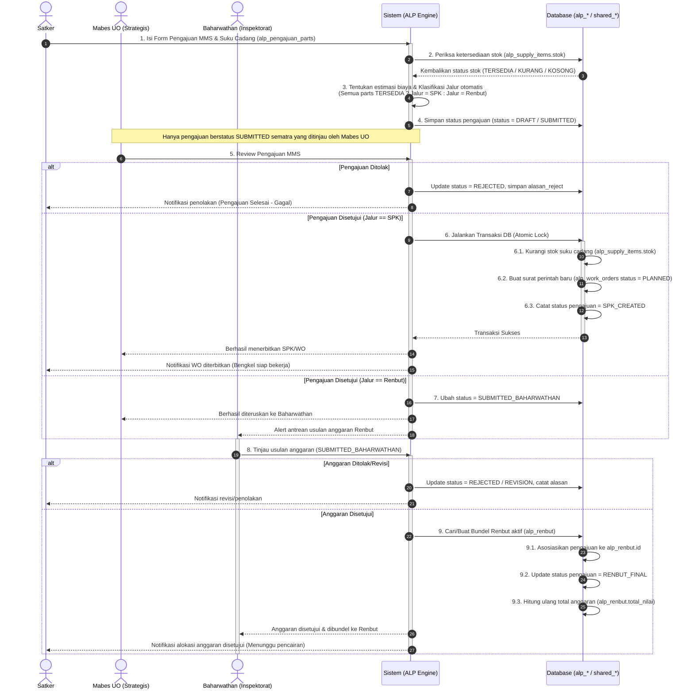
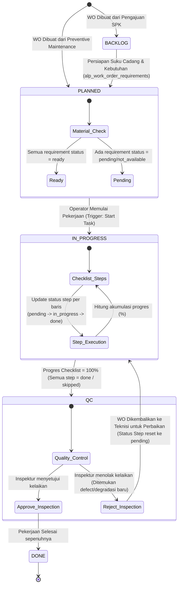
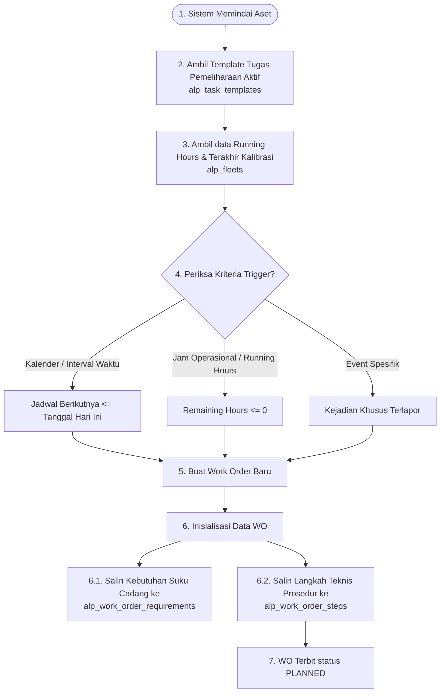

# Diagram Proses Bisnis (BISPRO) — Domain ALPALHAN (ALP)

Dokumen ini mendokumentasikan diagram alur proses bisnis (BISPRO), transisi status alur kerja (*state machine*), dan interaksi aktor untuk domain **ALPALHAN MRO (ALP)** berdasarkan skema database terdesentralisasi yang baru.

---

## 1. Alur Pengajuan MMS & Pemisahan Jalur (SPK vs Renbut)

Diagram urutan (*sequence diagram*) di bawah ini menggambarkan alur dari inisiasi pengajuan perawatan (MMS) oleh Satker, klasifikasi jalur otomatis oleh Sistem (berdasarkan ketersediaan suku cadang di gudang), proses persetujuan Mabes UO, hingga pemisahan ke Jalur SPK (Pembuatan WO) atau Jalur Renbut (Pengumpulan Anggaran di Baharwathan).

---

## 2. Siklus Hidup Transisi Status Work Order (WO)

Diagram status (*state machine*) berikut mendefinisikan transisi status Work Order di bengkel pemeliharaan secara ketat di backend. Perubahan status dari `BACKLOG` hingga `DONE` wajib divalidasi kebenarannya.

---

## 3. Siklus Pemeliharaan Preventif (Preventive Maintenance)

Diagram alur di bawah menggambarkan bagaimana sistem menjadwalkan pekerjaan pemeliharaan preventif secara otomatis berdasarkan template manual teknis (kalender, jam putar, atau kejadian eksternal).

