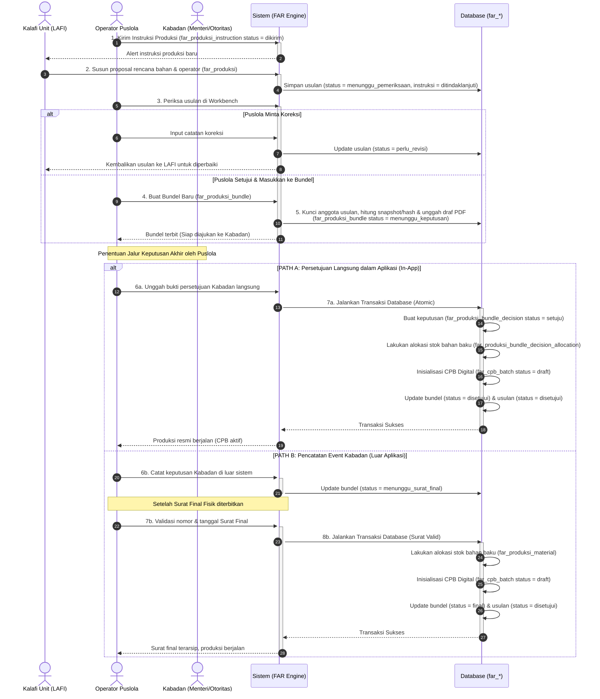
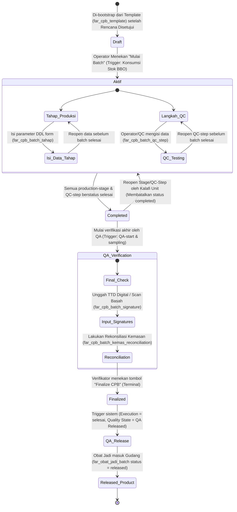
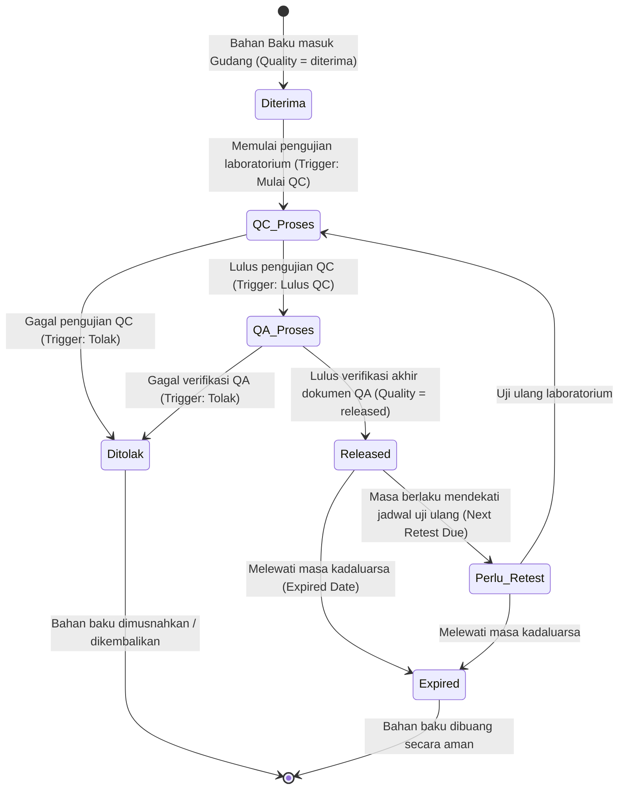

# Diagram Proses Bisnis (BISPRO) — Domain FARHAN (FAR)

Dokumen ini mendokumentasikan diagram alur proses bisnis (BISPRO), otorisasi produksi obat militer, dan penjaminan mutu untuk domain **FARHAN MRO (FAR)** berdasarkan skema database terdesentralisasi yang baru.

---

## 1. Alur Rencana Produksi & Bundling (Workbench Puslola)

Proses pengajuan rencana produksi dari Kalafi Unit (LAFI) yang diperiksa dan dibundel oleh Puslola. Proses persetujuan akhir mendukung dua jalur: **Jalur Aplikasi Langsung (Path A)** atau **Jalur Luar Aplikasi (Path B - Event Kabadan)**.

---

## 2. Siklus Hidup CPB (Catatan Pengolahan Batch) Digital

Diagram status (*state machine*) di bawah mendefinisikan transisi pelaksanaan produksi obat secara digital dari inisialisasi awal hingga perilisan produk obat jadi ke pasar.

---

## 3. Siklus Mutu Bahan Baku Obat (Quality State BBO)

Bahan baku obat (BBO) yang masuk ke LAFI harus melalui pengawasan mutu yang ketat sebelum diizinkan dikonsumsi dalam proses produksi.

