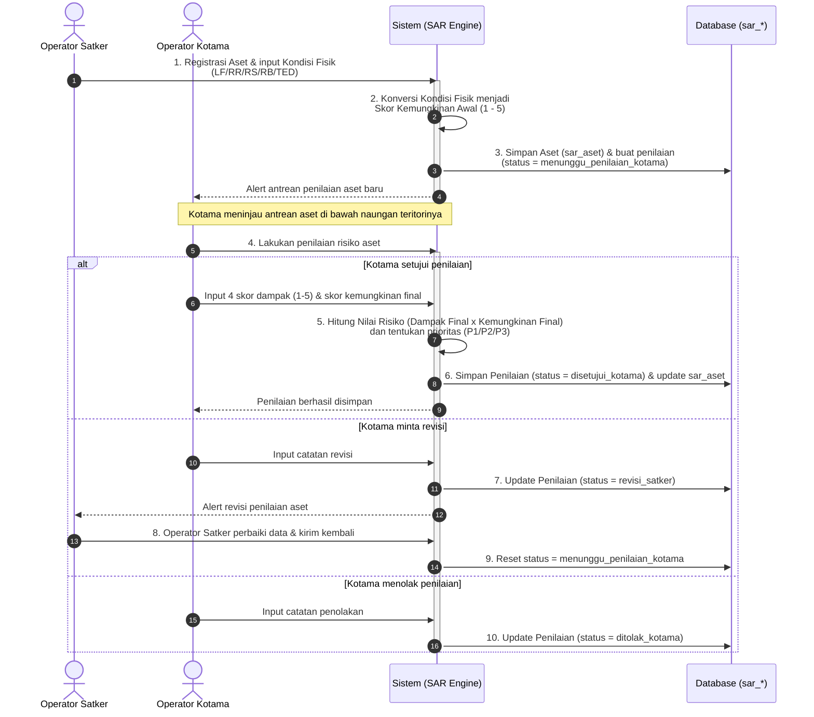
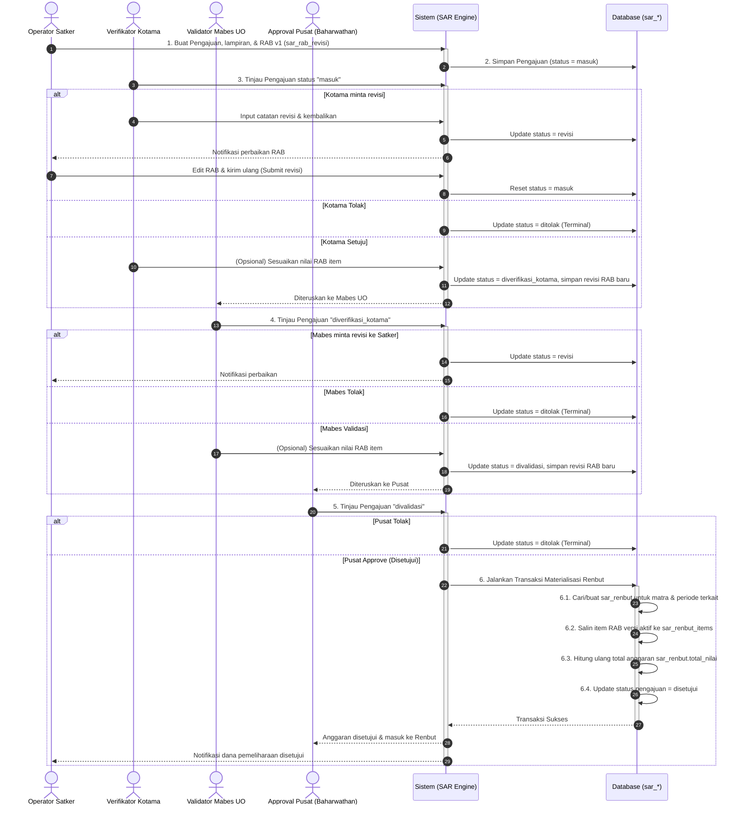
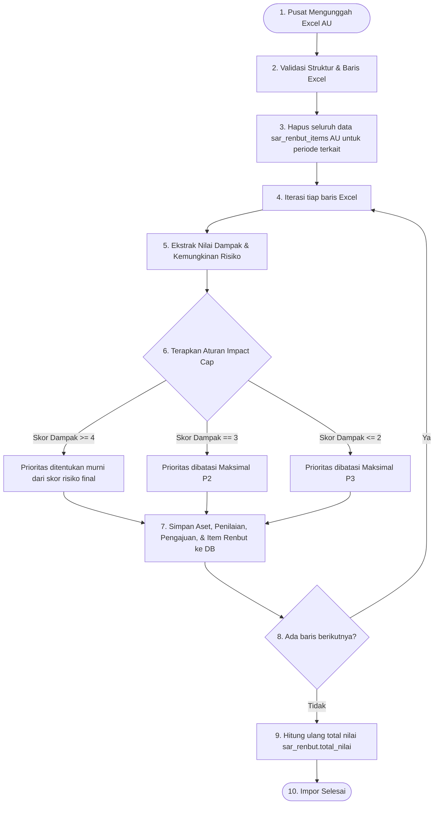

# Diagram Proses Bisnis (BISPRO) — Domain SARHAN (SAR)

Dokumen ini mendokumentasikan diagram alur proses bisnis (BISPRO), verifikasi berjenjang, dan logika penilaian risiko untuk domain **SARHAN MRO (SAR)** berdasarkan skema database terdesentralisasi yang baru.

---

## 1. Alur Penilaian Aset oleh Kotama

Proses penilaian kondisi fisik aset oleh Kotama bertujuan untuk menentukan tingkat risiko dan prioritas aset (P1/P2/P3) secara berjenjang dari bawah ke atas.

---

## 2. Alur Pengajuan Pemeliharaan & Verifikasi RAB Berjenjang

Proses pengajuan pemeliharaan sarana prasarana menggunakan alur persetujuan sangat ketat dari Operator Satker -> Kotama -> Mabes UO -> Pusat (Baharwathan), termasuk pemutakhiran versi RAB di setiap jenjang.

---

## 3. Alur Impor Excel TNI AU & Auto-Scoring dengan Impact Cap

Proses impor data Renbut massal milik TNI AU (AU) menggunakan logika khusus (*Impact Cap*) untuk membatasi tingkat prioritas berdasarkan tingkat dampak operasional.

