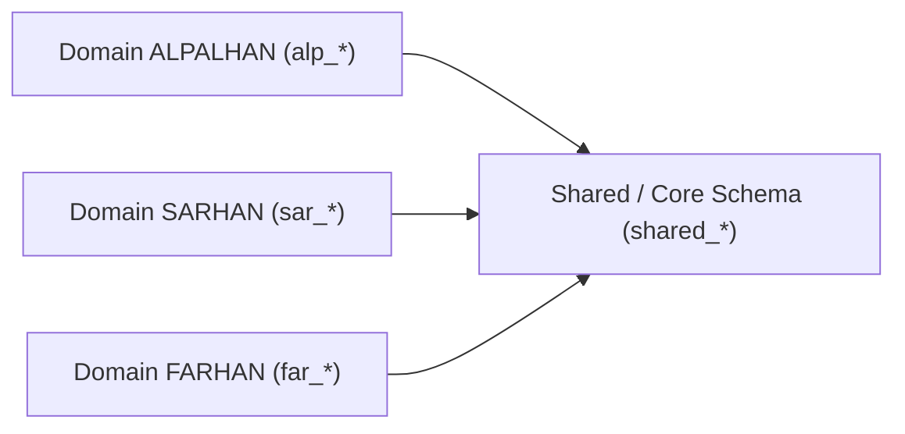

# Entity Relationship Diagram (ERD) Utama

Berkas ini adalah peta navigasi utama untuk diagram hubungan entitas (ERD) di seluruh domain bisnis Sysinfo Harwat.

## Diagram Hubungan Domain

## Detail ERD per Domain Bisnis
Guna mempermudah pembacaan, rancangan detail ERD beserta optimasi indexing dan normalisasi tabel dipisahkan ke berkas berikut:

* **ALPALHAN (ALP) ERD:** [docs/database/erd-alp.md](file:///d:/dev/sysinfo-harwat/.github/docs/database/erd-alp.md)
* **SARHAN (SAR) ERD:** [docs/database/erd-sar.md](file:///d:/dev/sysinfo-harwat/.github/docs/database/erd-sar.md)
* **FARHAN (FAR) ERD:** [docs/database/erd-far.md](file:///d:/dev/sysinfo-harwat/.github/docs/database/erd-far.md)
* **Shared / Core ERD:** [docs/database/erd-shared.md](file:///d:/dev/sysinfo-harwat/.github/docs/database/erd-shared.md)
