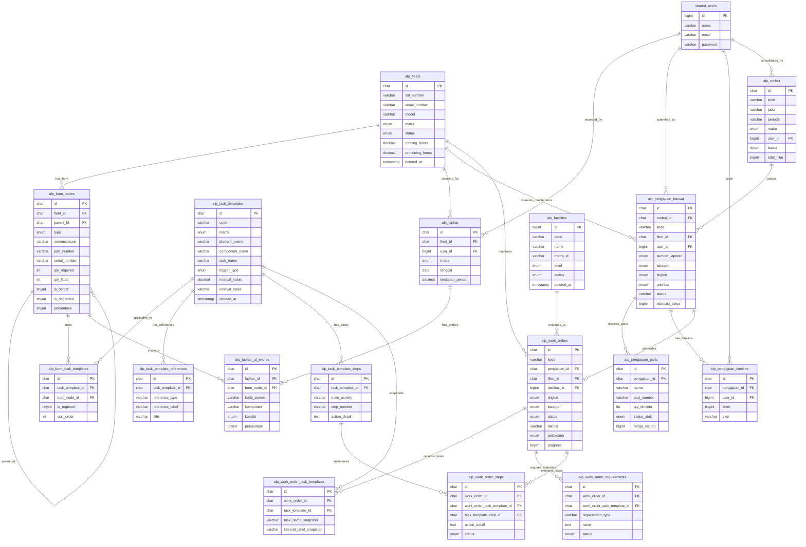

# Redesain ERD & Normalisasi — Domain ALPALHAN (ALP)

Dokumen ini mendefinisikan hasil redesain, pemisahan, dan normalisasi skema database domain **ALPALHAN MRO (ALP)** dari skema monolit `harwatdb`.

---

## 1. Diagram ERD (Mermaid)

---

## 2. Redesain Skema Tabel (alp_*)

### `alp_bom_nodes`
Representasi pohon (hierarki) komponen aset: Sistem (SYS) → Rakitan (ASSY) → Komponen (PART).
* **Kunci Utama:** `id` `char(26)` (ULID)
* **Kolom:**
  * `id` `char(26)` NOT NULL (PK)
  * `fleet_id` `char(26)` NOT NULL (FK ke `alp_fleets`)
  * `parent_id` `char(26)` NULL (FK self-reference ke `alp_bom_nodes.id`)
  * `type` `enum('SYS','ASSY','PART')` NOT NULL
  * `nomenclature` `varchar(255)` NOT NULL
  * `part_number` `varchar(255)` NOT NULL
  * `serial_number` `varchar(255)` NULL
  * `qty_required` `int` NOT NULL
  * `qty_fitted` `int` NOT NULL
  * `is_defect` `tinyint(1)` NOT NULL DEFAULT 0
  * `is_degraded` `tinyint(1)` NOT NULL DEFAULT 0
  * `persentase` `tinyint` unsigned NOT NULL DEFAULT 100
  * `keterangan` `text` NULL
  * `uraian_kerusakan` `text` NULL
  * `created_at` `timestamp` NULL
  * `updated_at` `timestamp` NULL
* **Indeks & Normalisasi:**
  * `INDEX alp_bom_nodes_fleet_parent_idx (fleet_id, parent_id)` (Composite index untuk mempercepat kueri rekursif hierarki BOM per aset).
  * `INDEX (parent_id)` (Indeks kolom foreign key).
  * `FULLTEXT INDEX alp_bom_nodes_search_idx (nomenclature, part_number, serial_number)` (Full-text index untuk pencarian cepat komponen).

### `alp_bom_task_templates`
Pemetaan template pemeliharaan preventif yang berlaku pada node BOM tertentu.
* **Kunci Utama:** `id` `char(26)` (ULID)
* **Kolom:**
  * `id` `char(26)` NOT NULL (PK)
  * `task_template_id` `char(26)` NOT NULL (FK ke `alp_task_templates`)
  * `bom_node_id` `char(26)` NOT NULL (FK ke `alp_bom_nodes`)
  * `is_required` `tinyint(1)` NOT NULL DEFAULT 1
  * `sort_order` `int` unsigned NOT NULL DEFAULT 0
  * `applicability_notes` `text` NULL
  * `created_at` `timestamp` NULL
  * `updated_at` `timestamp` NULL
* **Indeks & Normalisasi:**
  * `UNIQUE INDEX (task_template_id, bom_node_id)` (Mencegah duplikasi asosiasi template pada node yang sama).
  * `INDEX (bom_node_id)` (Indeks kolom foreign key).

### `alp_facilities`
Bengkel kerja/fasilitas pemeliharaan yang aktif.
* **Kunci Utama:** `id` `bigint` (Auto Increment)
* **Kolom:**
  * `id` `bigint` NOT NULL AUTO_INCREMENT (PK)
  * `kode` `varchar(255)` NULL (Unique)
  * `name` `varchar(255)` NOT NULL
  * `base_id` `varchar(255)` NULL
  * `matra_id` `varchar(10)` NOT NULL
  * `level` `enum('ringan','teknik','depo')` NOT NULL
  * `description` `text` NULL
  * `latitude` `decimal(10, 7)` NULL *(Penyesuaian presisi koordinat)*
  * `longitude` `decimal(10, 7)` NULL *(Penyesuaian presisi koordinat)*
  * `status` `enum('aktif','nonaktif')` NOT NULL DEFAULT 'aktif'
  * `created_at` `timestamp` NULL
  * `updated_at` `timestamp` NULL
  * `deleted_at` `timestamp` NULL *(Mendukung Soft Delete)*
* **Indeks & Normalisasi:**
  * `UNIQUE INDEX (kode)`

### `alp_fleets`
Entitas aset utama ALPALHAN.
* **Kunci Utama:** `id` `char(26)` (ULID)
* **Kolom:**
  * `id` `char(26)` NOT NULL (PK)
  * `tail_number` `varchar(255)` NOT NULL
  * `serial_number` `varchar(255)` NOT NULL
  * `model` `varchar(255)` NOT NULL
  * `matra` `enum('AD','AL','AU')` NOT NULL
  * `kategori` `varchar(255)` NOT NULL
  * `satuan` `varchar(255)` NOT NULL
  * `base` `varchar(255)` NOT NULL
  * `foto_url` `varchar(255)` NULL
  * `status` `enum('FMC','PMC','NMC')` NOT NULL
  * `e_doc_path` `varchar(255)` NULL
  * `running_hours` `decimal(10, 2)` NOT NULL DEFAULT 0.00 *(Penyesuaian presisi decimal)*
  * `cycles` `int` NOT NULL DEFAULT 0
  * `next_maintenance` `varchar(255)` NULL
  * `remaining_hours` `decimal(10, 2)` NOT NULL DEFAULT 0.00 *(Penyesuaian presisi decimal)*
  * `sertifikat_kelaikan` `text` NULL
  * `riwayat_docking` `text` NULL
  * `kesimpulan` `text` NULL
  * `kesiapan` `text` NULL
  * `created_at` `timestamp` NULL
  * `updated_at` `timestamp` NULL
  * `deleted_at` `timestamp` NULL *(Mendukung Soft Delete)*
* **Indeks & Normalisasi:**
  * `FULLTEXT INDEX alp_fleets_search_idx (tail_number, serial_number, model)` (Pencarian cepat aset berdasarkan nomor ekor, nomor seri, dan model).

### `alp_laphar`
Header laporan harian kondisi kesiapan aset per hari.
* **Kunci Utama:** `id` `char(26)` (ULID)
* **Kolom:**
  * `id` `char(26)` NOT NULL (PK)
  * `fleet_id` `char(26)` NOT NULL (FK ke `alp_fleets`)
  * `user_id` `bigint` NOT NULL (FK ke `shared_users.id`)
  * `matra` `enum('AD','AL','AU')` NOT NULL
  * `tanggal` `date` NOT NULL
  * `kesiapan_persen` `decimal(5, 2)` NOT NULL DEFAULT 0.00 *(Penyesuaian presisi)*
  * `catatan` `text` NULL
  * `created_at` `timestamp` NULL
  * `updated_at` `timestamp` NULL
* **Indeks & Normalisasi:**
  * `INDEX (fleet_id)`
  * `INDEX (user_id)`
  * `INDEX (tanggal)`

### `alp_laphar_al_entries`
Detail entry laporan harian kondisi komponen untuk angkatan laut (AL).
* **Kunci Utama:** `id` `char(26)` (ULID)
* **Kolom:**
  * `id` `char(26)` NOT NULL (PK)
  * `laphar_id` `char(26)` NOT NULL (FK ke `alp_laphar` ON DELETE CASCADE)
  * `bom_node_id` `char(26)` NOT NULL (FK ke `alp_bom_nodes`)
  * `kode_sistem` `varchar(255)` NOT NULL
  * `komponen` `varchar(255)` NOT NULL
  * `kondisi` `enum('S','TS')` NOT NULL
  * `persentase` `tinyint` unsigned NOT NULL DEFAULT 100
  * `jam_putar` `int` NULL
  * `uraian_kerusakan` `text` NULL
  * `pelaksana` `varchar(255)` NULL
  * `keterangan` `text` NULL
  * `created_at` `timestamp` NULL
  * `updated_at` `timestamp` NULL
* **Indeks & Normalisasi:**
  * `INDEX alp_laphar_al_entries_composite_idx (laphar_id, bom_node_id)` (Composite index untuk query cepat detail komponen laporan).
  * `INDEX (bom_node_id)`

### `alp_pengajuan_harwat`
Usulan pemeliharaan dan perawatan yang diajukan oleh Satker.
* **Kunci Utama:** `id` `char(26)` (ULID)
* **Kolom:**
  * `id` `char(26)` NOT NULL (PK)
  * `renbut_id` `char(26)` NULL (FK ke `alp_renbut` ON DELETE SET NULL)
  * `kode` `varchar(255)` NOT NULL (Unique)
  * `fleet_id` `char(26)` NOT NULL (FK ke `alp_fleets`)
  * `user_id` `bigint` NOT NULL (FK ke `shared_users.id`)
  * `sumber_laporan` `enum('Pilot','Mekanik','Inspeksi')` NOT NULL
  * `kategori` `enum('Terjadwal','Tidak Terjadwal')` NOT NULL
  * `tingkat` `enum('Ringan','Sedang','Berat')` NOT NULL
  * `fasilitas_nama` `varchar(255)` NULL
  * `prioritas` `enum('NORMAL','TINGGI','KRITIS')` NOT NULL
  * `periode` `varchar(10)` NOT NULL
  * `deskripsi` `text` NOT NULL
  * `estimasi_biaya` `bigint` NOT NULL DEFAULT 0
  * `status` `varchar(255)` NOT NULL DEFAULT 'DRAFT'
  * `jalur` `varchar(255)` NULL
  * `stock_status` `varchar(255)` NULL
  * `approved_mabes_by` `bigint` NULL (FK ke `shared_users.id`)
  * `approved_mabes_at` `timestamp` NULL
  * `approved_baharwathan_by` `bigint` NULL (FK ke `shared_users.id`)
  * `approved_baharwathan_at` `timestamp` NULL
  * `rejected_by` `bigint` NULL (FK ke `shared_users.id`)
  * `rejected_at` `timestamp` NULL
  * `catatan_reviewer` `text` NULL
  * `alasan_reject` `text` NULL
  * `created_at` `timestamp` NULL
  * `updated_at` `timestamp` NULL
* **Indeks & Normalisasi:**
  * `UNIQUE INDEX (kode)`
  * `INDEX (fleet_id)`
  * `INDEX (renbut_id)`
  * `INDEX (user_id)`
  * `FULLTEXT INDEX alp_pengajuan_search_idx (kode, deskripsi)` (Full-text index untuk mempermudah pencarian MMS).

### `alp_pengajuan_parts`
Daftar suku cadang yang dibutuhkan dalam satu pengajuan harwat.
* **Kunci Utama:** `id` `char(26)` (ULID)
* **Kolom:**
  * `id` `char(26)` NOT NULL (PK)
  * `pengajuan_id` `char(26)` NOT NULL (FK ke `alp_pengajuan_harwat` ON DELETE CASCADE)
  * `nama` `varchar(255)` NOT NULL
  * `part_number` `varchar(255)` NOT NULL
  * `qty_diminta` `int` NOT NULL
  * `qty_gudang` `int` NOT NULL DEFAULT 0
  * `status_stok` `enum('TERSEDIA','KURANG','KOSONG')` NOT NULL
  * `harga_satuan` `bigint` NOT NULL DEFAULT 0
  * `created_at` `timestamp` NULL
  * `updated_at` `timestamp` NULL
* **Indeks & Normalisasi:**
  * `INDEX alp_pengajuan_parts_composite_idx (pengajuan_id, status_stok)` (Composite index untuk mempercepat filter ketersediaan stok).

### `alp_pengajuan_timeline`
Log audit kronologis dari setiap tindakan persetujuan/penolakan pengajuan.
* **Kunci Utama:** `id` `char(26)` (ULID)
* **Kolom:**
  * `id` `char(26)` NOT NULL (PK)
  * `pengajuan_id` `char(26)` NOT NULL (FK ke `alp_pengajuan_harwat` ON DELETE CASCADE)
  * `user_id` `bigint` NOT NULL (FK ke `shared_users.id`)
  * `level` `tinyint` NOT NULL
  * `aksi` `varchar(255)` NOT NULL
  * `catatan` `text` NULL
  * `created_at` `timestamp` NULL
  * `updated_at` `timestamp` NULL
* **Indeks & Normalisasi:**
  * `INDEX (pengajuan_id)`
  * `INDEX (user_id)`

### `alp_renbut`
Bundel rencana kebutuhan anggaran pemeliharaan per periode/matra.
* **Kunci Utama:** `id` `char(26)` (ULID)
* **Kolom:**
  * `id` `char(26)` NOT NULL (PK)
  * `kode` `varchar(255)` NOT NULL (Unique)
  * `judul` `varchar(255)` NULL
  * `periode` `varchar(255)` NOT NULL
  * `matra` `enum('AD','AL','AU')` NOT NULL
  * `user_id` `bigint` NOT NULL (FK ke `shared_users.id`)
  * `status` `enum('DRAFT','SUBMITTED','REVIEW','REVISION','APPROVED','REJECTED')` NOT NULL DEFAULT 'DRAFT'
  * `total_nilai` `bigint` NOT NULL DEFAULT 0
  * `catatan_mabes` `text` NULL
  * `alasan_revisi` `text` NULL
  * `ttd_nama` `varchar(255)` NULL
  * `ttd_jabatan` `varchar(255)` NULL
  * `created_at` `timestamp` NULL
  * `updated_at` `timestamp` NULL
* **Indeks & Normalisasi:**
  * `UNIQUE INDEX (kode)`
  * `INDEX (user_id)`

### `alp_supply_items`
Katalog persediaan suku cadang/gudang logistik.
* **Kunci Utama:** `id` `char(26)` (ULID)
* **Kolom:**
  * `id` `char(26)` NOT NULL (PK)
  * `nama` `varchar(255)` NOT NULL
  * `part_number` `varchar(255)` NOT NULL
  * `kategori` `enum('Komponen','Suku Cadang')` NOT NULL
  * `matra` `enum('AD','AL','AU')` NOT NULL
  * `lokasi_gudang` `varchar(255)` NOT NULL
  * `stok` `int` NOT NULL DEFAULT 0
  * `minimum_stok` `int` NOT NULL DEFAULT 0
  * `harga_satuan` `bigint` NOT NULL DEFAULT 0
  * `created_at` `timestamp` NULL
  * `updated_at` `timestamp` NULL
* **Indeks & Normalisasi:**
  * `INDEX (part_number)`
  * `FULLTEXT INDEX alp_supply_items_search_idx (nama, part_number)` (Full-text index untuk mempermudah operator gudang dalam pencarian suku cadang).

### `alp_task_templates`
Daftar template prosedur pemeliharaan preventif.
* **Kunci Utama:** `id` `char(26)` (ULID)
* **Kolom:**
  * `id` `char(26)` NOT NULL (PK)
  * `code` `varchar(255)` NULL
  * `matra` `enum('AD','AL','AU')` NULL
  * `platform_name` `varchar(255)` NULL
  * `component_name` `varchar(255)` NULL
  * `package` `varchar(255)` NULL
  * `task_name` `varchar(255)` NOT NULL
  * `trigger_type` `enum('CALENDAR','OPERATING_HOURS','EVENT')` NOT NULL
  * `interval_value` `decimal(10, 2)` NULL DEFAULT 0.00
  * `interval_unit` `varchar(255)` NULL
  * `interval_label` `varchar(255)` NOT NULL
  * `maintenance_level` `varchar(255)` NULL
  * `duration_minutes` `int` NULL
  * `duration_label` `varchar(255)` NULL
  * `personnel_requirements` `json` NULL
  * `tool_requirements` `json` NULL
  * `equipment_requirements` `json` NULL
  * `spare_part_requirements` `json` NULL
  * `main_activities` `json` NULL
  * `source_document` `varchar(255)` NULL
  * `source_reference` `varchar(255)` NULL
  * `is_active` `tinyint(1)` NOT NULL DEFAULT 1
  * `notes` `text` NULL
  * `created_at` `timestamp` NULL
  * `updated_at` `timestamp` NULL
  * `deleted_at` `timestamp` NULL *(Mendukung Soft Delete)*

### `alp_task_template_references`
Dokumen referensi manual/buku panduan teknis untuk template pemeliharaan.
* **Kunci Utama:** `id` `char(26)` (ULID)
* **Kolom:**
  * `id` `char(26)` NOT NULL (PK)
  * `task_template_id` `char(26)` NOT NULL (FK ke `alp_task_templates` ON DELETE CASCADE)
  * `reference_type` `varchar(255)` NOT NULL
  * `reference_label` `varchar(255)` NULL
  * `title` `varchar(255)` NULL
  * `description` `text` NULL
  * `source_document` `varchar(255)` NULL
  * `uri` `varchar(255)` NULL
  * `sort_order` `int` NOT NULL DEFAULT 0
  * `created_at` `timestamp` NULL
  * `updated_at` `timestamp` NULL
* **Indeks & Normalisasi:**
  * `INDEX (task_template_id)`

### `alp_task_template_steps`
Instruksi langkah kerja detail untuk template pemeliharaan.
* **Kunci Utama:** `id` `char(26)` (ULID)
* **Kolom:**
  * `id` `char(26)` NOT NULL (PK)
  * `task_template_id` `char(26)` NOT NULL (FK ke `alp_task_templates` ON DELETE CASCADE)
  * `main_activity` `varchar(255)` NULL
  * `procedure_reference` `varchar(255)` NULL
  * `step_number` `varchar(255)` NULL
  * `stage` `varchar(255)` NULL
  * `action_detail` `text` NOT NULL
  * `acceptance_criteria` `text` NULL
  * `related_figure` `varchar(255)` NULL
  * `sort_order` `int` NOT NULL DEFAULT 0
  * `created_at` `timestamp` NULL
  * `updated_at` `timestamp` NULL
* **Indeks & Normalisasi:**
  * `INDEX (task_template_id)`

### `alp_work_orders`
Surat perintah kerja pemeliharaan di Bengkel.
* **Kunci Utama:** `id` `char(26)` (ULID)
* **Kolom:**
  * `id` `char(26)` NOT NULL (PK)
  * `kode` `varchar(255)` NOT NULL (Unique)
  * `pengajuan_id` `char(26)` NULL (FK ke `alp_pengajuan_harwat` ON DELETE SET NULL)
  * `fleet_id` `char(26)` NOT NULL (FK ke `alp_fleets`)
  * `fasilitas_id` `bigint` NULL (FK ke `alp_facilities` ON DELETE SET NULL)
  * `tingkat` `enum('Ringan','Sedang','Berat')` NOT NULL
  * `kategori` `enum('Terjadwal','Tidak Terjadwal')` NOT NULL
  * `status` `enum('BACKLOG','PLANNED','IN_PROGRESS','QC','DONE')` NOT NULL DEFAULT 'BACKLOG'
  * `teknisi` `varchar(255)` NULL
  * `pelaksana` `enum('SATKER','L2_PEMELIHARA','L3_DEPO')` NOT NULL
  * `progress` `tinyint` unsigned NOT NULL DEFAULT 0
  * `estimasi_jam` `int` NOT NULL DEFAULT 0
  * `prioritas` `enum('NORMAL','TINGGI','KRITIS')` NOT NULL
  * `deskripsi` `text` NOT NULL
  * `created_at` `timestamp` NULL
  * `updated_at` `timestamp` NULL
* **Indeks & Normalisasi:**
  * `UNIQUE INDEX (kode)`
  * `INDEX (fleet_id)`
  * `INDEX (pengajuan_id)`
  * `INDEX (fasilitas_id)`
  * `FULLTEXT INDEX alp_work_orders_search_idx (kode, deskripsi, teknisi)` (Full-text index untuk mempermudah pencarian WO).

### `alp_work_order_task_templates`
Snapshot dari template tugas pemeliharaan preventif yang dikaitkan ke WO saat dibuat.
* **Kunci Utama:** `id` `char(26)` (ULID)
* **Kolom:**
  * `id` `char(26)` NOT NULL (PK)
  * `work_order_id` `char(26)` NOT NULL (FK ke `alp_work_orders` ON DELETE CASCADE)
  * `task_template_id` `char(26)` NOT NULL (FK ke `alp_task_templates`)
  * `component_name_snapshot` `varchar(255)` NULL
  * `task_name_snapshot` `varchar(255)` NOT NULL
  * `interval_label_snapshot` `varchar(255)` NOT NULL
  * `maintenance_level_snapshot` `varchar(255)` NULL
  * `source_document_snapshot` `varchar(255)` NULL
  * `source_reference_snapshot` `varchar(255)` NULL
  * `next_due_snapshot` `varchar(255)` NULL
  * `target_start_date` `date` NULL
  * `target_finish_date` `date` NULL
  * `notes` `text` NULL
  * `created_at` `timestamp` NULL
  * `updated_at` `timestamp` NULL
* **Indeks & Normalisasi:**
  * `INDEX (work_order_id)`
  * `INDEX (task_template_id)`

### `alp_work_order_requirements`
Snapshot kebutuhan material/suku cadang untuk WO saat ini beserta status pengeluarannya.
* **Kunci Utama:** `id` `char(26)` (ULID)
* **Kolom:**
  * `id` `char(26)` NOT NULL (PK)
  * `work_order_id` `char(26)` NOT NULL (FK ke `alp_work_orders` ON DELETE CASCADE)
  * `work_order_task_template_id` `char(26)` NULL (FK ke `alp_work_order_task_templates` ON DELETE SET NULL)
  * `requirement_type` `varchar(255)` NOT NULL
  * `name` `text` NOT NULL
  * `status` `enum('pending','ready','issued','not_available','returned')` NOT NULL DEFAULT 'pending'
  * `checked_by` `bigint` NULL (FK ke `shared_users.id` ON DELETE SET NULL)
  * `checked_at` `timestamp` NULL
  * `notes` `text` NULL
  * `sort_order` `int` NOT NULL DEFAULT 0
  * `created_at` `timestamp` NULL
  * `updated_at` `timestamp` NULL
* **Indeks & Normalisasi:**
  * `INDEX (work_order_id)`
  * `INDEX (checked_by)`

### `alp_work_order_steps`
Langkah kerja WO hasil instansiasi dari template langkah teknis.
* **Kunci Utama:** `id` `char(26)` (ULID)
* **Kolom:**
  * `id` `char(26)` NOT NULL (PK)
  * `work_order_id` `char(26)` NOT NULL (FK ke `alp_work_orders` ON DELETE CASCADE)
  * `work_order_task_template_id` `char(26)` NULL (FK ke `alp_work_order_task_templates` ON DELETE SET NULL)
  * `task_template_step_id` `char(26)` NULL (FK ke `alp_task_template_steps` ON DELETE SET NULL)
  * `main_activity` `varchar(255)` NULL
  * `step_number` `varchar(255)` NULL
  * `stage` `varchar(255)` NULL
  * `action_detail` `text` NOT NULL
  * `acceptance_criteria` `text` NULL
  * `status` `enum('pending','in_progress','done','skipped','na')` NOT NULL DEFAULT 'pending'
  * `checked_by` `bigint` NULL (FK ke `shared_users.id` ON DELETE SET NULL)
  * `checked_at` `timestamp` NULL
  * `notes` `text` NULL
  * `sort_order` `int` NOT NULL DEFAULT 0
  * `created_at` `timestamp` NULL
  * `updated_at` `timestamp` NULL
* **Indeks & Normalisasi:**
  * `INDEX alp_work_order_steps_status_idx (work_order_id, status)` (Composite index untuk mempercepat kalkulasi progress WO di tingkat backend/service).
  * `INDEX (checked_by)`
