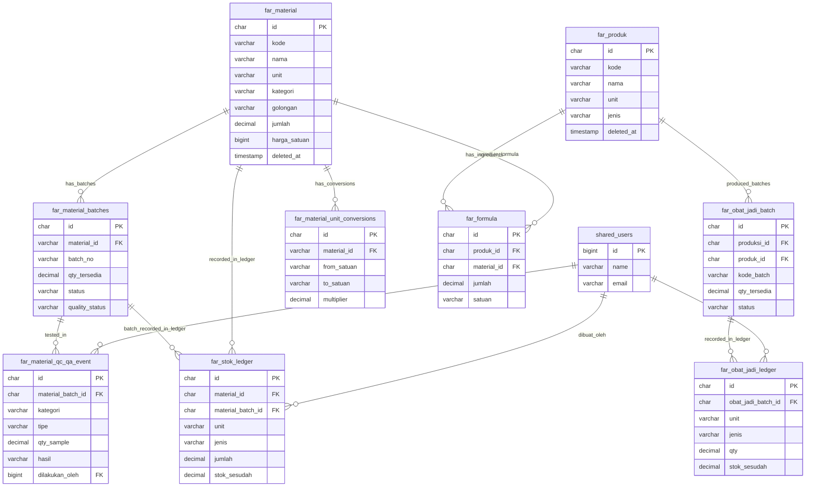
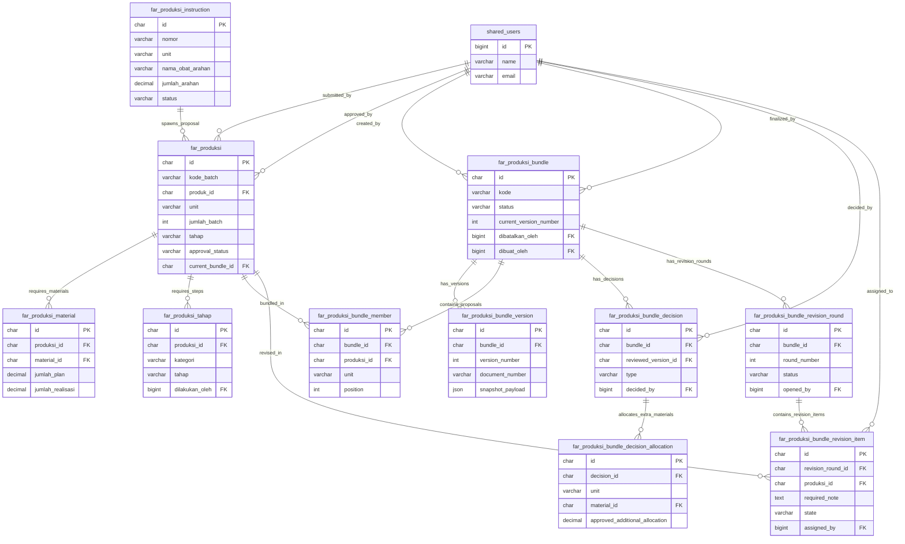
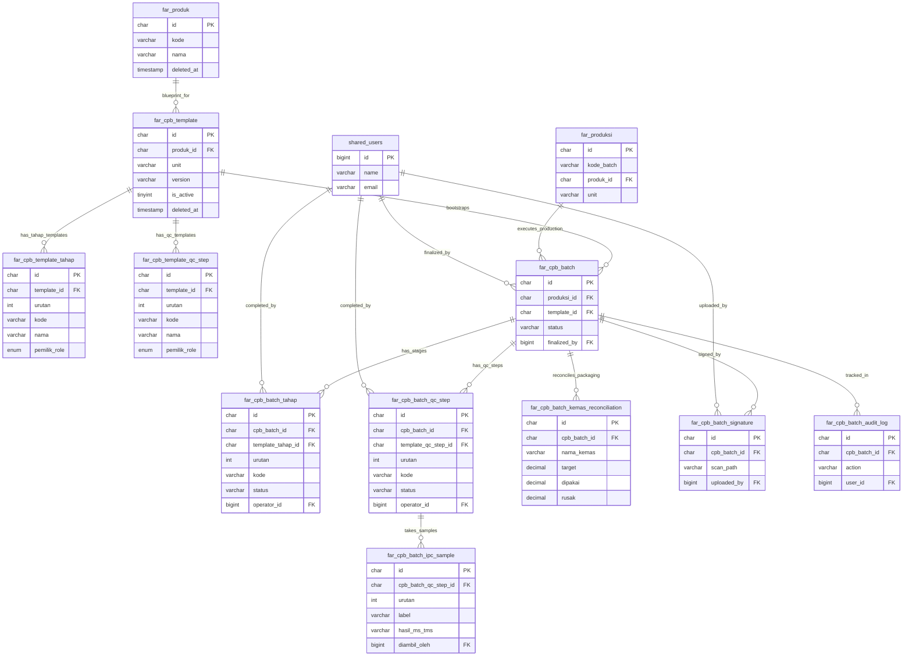

# Redesain ERD & Normalisasi — Domain FARHAN (FAR)

Dokumen ini mendefinisikan hasil redesain, pemisahan, dan normalisasi skema database domain **FARHAN MRO (FAR)** dari skema monolit `harwatdb`.

---

## 1. Diagram ERD Modular (Mermaid)

Karena domain Farhan sangat besar (63 tabel), diagram ERD dibagi menjadi 3 sub-modul logis: **Logistik & Persediaan**, **Production Approval & Workbench**, dan **CPB Digital (Catatan Pengolahan Batch)**.

### Sub-Modul A: Logistik & Persediaan (Logistics)

### Sub-Modul B: Production Approval & Workbench

### Sub-Modul C: CPB Digital (Catatan Pengolahan Batch)

---

## 2. Penyesuaian Skema & Normalisasi Kolom (far_*)

Untuk meningkatkan efisiensi dan keamanan data, penyesuaian (*adjustments*) berikut diterapkan pada berkas `baharwat-schema-only.sql`:

1. **Perbaikan Tipe Data Desimal (Truncation Fix):**
   * Semua kolom volume, kuantitas bahan, dan multiplier konversi yang terpotong tipe desimalnya (`decimal(15` atau `decimal(18`) dikembalikan ke presisi yang benar:
     * `multiplier` dan `conversion_multiplier` -> `decimal(18, 6)`
     * `bobot_per_satuan` & `jumlah` (formula) -> `decimal(15, 4)`
     * `volume`, `jumlah` (stok/mutasi) -> `decimal(15, 2)`
     * `latitude`, `longitude` -> `decimal(10, 7)`
2. **Indeks Komposit & FK:**
   * `far_cpb_batch_audit_log` -> `INDEX (cpb_batch_id, created_at)`
   * `far_cpb_batch_tahap` -> `INDEX (cpb_batch_id, urutan)`
   * `far_cpb_batch_qc_step` -> `INDEX (cpb_batch_id, urutan)`
   * `far_stok_ledger` -> `INDEX (material_id, material_batch_id, unit)` (Mempercepat perhitungan live saldo stok).
   * Indeks foreign key dipasang pada seluruh relasi relasional utama.
3. **Full-Text Indexing (Pencarian Cepat):**
   * `far_material` -> `FULLTEXT INDEX (kode, nama)`
   * `far_produk` -> `FULLTEXT INDEX (kode, nama)`
   * `far_produksi_instruction` -> `FULLTEXT INDEX (nomor, nama_obat_arahan)`
   * `far_puslola_renbut_items` -> `FULLTEXT INDEX (uraian)`
4. **Relasi Foreign Key Bersama (Shared):**
   * Semua referensi pengguna seperti `operator_id`, `approved_oleh`, `dibuat_oleh`, `decided_by`, `assigned_by`, dll. diarahkan secara tegas merujuk ke `shared_users.id`.
5. **Dukungan Soft Delete (deleted_at):**
   * Kolom `deleted_at` `timestamp` NULL ditambahkan pada tabel-tabel master data penting berikut guna menjaga integritas data historis:
     * `far_material`
     * `far_produk`
     * `far_cpb_template`
     * `far_suppliers`
     * `far_personel`
