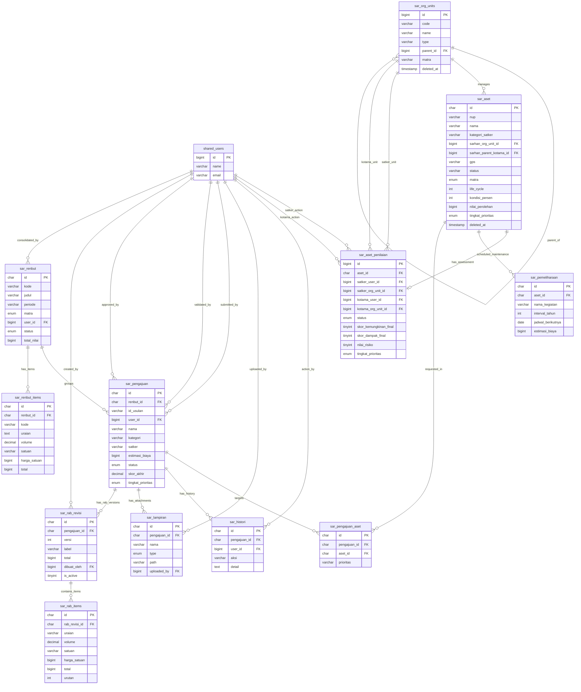

# Redesain ERD & Normalisasi — Domain SARHAN (SAR)

Dokumen ini mendefinisikan hasil redesain, pemisahan, dan normalisasi skema database domain **SARHAN MRO (SAR)** dari skema monolit `harwatdb`.

---

## 1. Diagram ERD (Mermaid)

---

## 2. Redesain Skema Tabel (sar_*)

### `sar_aset`
Master data aset sarana dan prasarana pertahanan.
* **Kunci Utama:** `id` `char(26)` (ULID)
* **Kolom:**
  * `id` `char(26)` NOT NULL (PK)
  * `nup` `varchar(255)` NOT NULL
  * `nama` `varchar(255)` NOT NULL
  * `kategori_satker` `varchar(255)` NOT NULL
  * `sarhan_org_unit_id` `bigint` NULL (FK ke `sar_org_units.id`)
  * `sarhan_parent_kotama_id` `bigint` NULL (FK ke `sar_org_units.id`)
  * `gps` `varchar(255)` NULL
  * `status` `varchar(255)` NULL
  * `matra` `enum('KEMHAN','MABES','AD','AL','AU')` NULL
  * `jenis_bangunan` `varchar(255)` NULL
  * `life_cycle` `int` NOT NULL DEFAULT 0
  * `kondisi_persen` `int` NOT NULL DEFAULT 0
  * `kondisi_desc` `text` NULL
  * `tahun_perolehan` `int` NULL
  * `nilai_perolehan` `bigint` NOT NULL DEFAULT 0
  * `data_kib` `json` NULL
  * `data_teknis` `json` NULL
  * `lokasi` `json` NULL
  * `pengadaan` `json` NULL
  * `administrasi` `json` NULL
  * `galeri` `json` NULL
  * `denah_koordinat` `json` NULL
  * `skor_dampak_operasional` `tinyint` NULL
  * `skor_dampak_keselamatan` `tinyint` NULL
  * `skor_dampak_keuangan` `tinyint` NULL
  * `skor_dampak_final` `tinyint` NULL
  * `skor_kemungkinan` `tinyint` NULL
  * `nilai_risiko` `tinyint` NULL
  * `tingkat_prioritas` `enum('P1','P2','P3')` NULL
  * `created_at` `timestamp` NULL
  * `updated_at` `timestamp` NULL
  * `deleted_at` `timestamp` NULL *(Mendukung Soft Delete)*
* **Indeks & Normalisasi:**
  * `INDEX (sarhan_org_unit_id)`
  * `INDEX (sarhan_parent_kotama_id)`
  * `FULLTEXT INDEX sar_aset_search_idx (nup, nama)` (Full-text index untuk mempermudah pencarian aset berdasarkan NUP dan nama).

### `sar_aset_penilaian`
Log transaksi penilaian kondisi & tingkat risiko aset oleh Kotama.
* **Kunci Utama:** `id` `bigint` (Auto Increment)
* **Kolom:**
  * `id` `bigint` NOT NULL AUTO_INCREMENT (PK)
  * `aset_id` `char(26)` NOT NULL (FK ke `sar_aset` ON DELETE CASCADE)
  * `satker_user_id` `bigint` NULL (FK ke `shared_users.id`)
  * `satker_org_unit_id` `bigint` NULL (FK ke `sar_org_units.id`)
  * `kotama_user_id` `bigint` NULL (FK ke `shared_users.id`)
  * `kotama_org_unit_id` `bigint` NULL (FK ke `sar_org_units.id`)
  * `status` `enum('draft','menunggu_penilaian_kotama','revisi_satker','disetujui_kotama','ditolak_kotama')` NOT NULL DEFAULT 'draft'
  * `skor_kemungkinan_awal` `tinyint` NULL
  * `skor_kemungkinan_final` `tinyint` NULL
  * `skor_dampak_operasional` `tinyint` NULL
  * `skor_dampak_keselamatan` `tinyint` NULL
  * `skor_dampak_keuangan` `tinyint` NULL
  * `skor_dampak_final` `tinyint` NULL
  * `nilai_risiko` `tinyint` NULL
  * `tingkat_prioritas` `enum('P1','P2','P3')` NULL
  * `catatan_operator` `text` NULL
  * `catatan_kotama` `text` NULL
  * `submitted_at` `timestamp` NULL
  * `reviewed_at` `timestamp` NULL
  * `approved_at` `timestamp` NULL
  * `rejected_at` `timestamp` NULL
  * `created_at` `timestamp` NULL
  * `updated_at` `timestamp` NULL
* **Indeks & Normalisasi:**
  * `INDEX sar_aset_penilaian_composite_idx (aset_id, status)` (Composite index untuk mempermudah pengambilan penilaian terbaru dari suatu aset).
  * `INDEX (satker_org_unit_id)`
  * `INDEX (kotama_org_unit_id)`

### `sar_histori`
Jejak audit kronologis tindakan atas pengajuan pemeliharaan.
* **Kunci Utama:** `id` `char(26)` (ULID)
* **Kolom:**
  * `id` `char(26)` NOT NULL (PK)
  * `pengajuan_id` `char(26)` NOT NULL (FK ke `sar_pengajuan` ON DELETE CASCADE)
  * `user_id` `bigint` NULL (FK ke `shared_users.id`)
  * `aksi` `varchar(255)` NOT NULL
  * `detail` `text` NOT NULL
  * `data_snapshot` `json` NULL
  * `created_at` `timestamp` NULL
  * `updated_at` `timestamp` NULL
* **Indeks & Normalisasi:**
  * `INDEX (pengajuan_id)`

### `sar_lampiran`
Berkas bukti dukung digital (PDF/gambar) untuk pengajuan pemeliharaan.
* **Kunci Utama:** `id` `char(26)` (ULID)
* **Kolom:**
  * `id` `char(26)` NOT NULL (PK)
  * `pengajuan_id` `char(26)` NOT NULL (FK ke `sar_pengajuan` ON DELETE CASCADE)
  * `nama` `varchar(255)` NOT NULL
  * `type` `enum('pdf','image')` NOT NULL
  * `path` `varchar(255)` NOT NULL
  * `uploaded_by` `bigint` NULL (FK ke `shared_users.id`)
  * `created_at` `timestamp` NULL
  * `updated_at` `timestamp` NULL
* **Indeks & Normalisasi:**
  * `INDEX (pengajuan_id)`

### `sar_org_units`
Struktur organisasi hierarkis (Kemhan -> Mabes -> Kotama -> Satker).
* **Kunci Utama:** `id` `bigint` (Auto Increment)
* **Kolom:**
  * `id` `bigint` NOT NULL AUTO_INCREMENT (PK)
  * `code` `varchar(255)` NOT NULL
  * `name` `varchar(255)` NOT NULL
  * `type` `varchar(255)` NOT NULL
  * `parent_id` `bigint` NULL (FK self-reference ke `sar_org_units.id`)
  * `matra` `varchar(255)` NULL
  * `kota` `varchar(255)` NULL
  * `provinsi` `varchar(255)` NULL
  * `meta` `json` NULL
  * `created_at` `timestamp` NULL
  * `updated_at` `timestamp` NULL
  * `deleted_at` `timestamp` NULL *(Mendukung Soft Delete)*
* **Indeks & Normalisasi:**
  * `INDEX sar_org_units_tree_idx (parent_id, type)` (Composite index untuk mempercepat pencarian data hierarki organisasi).

### `sar_pemeliharaan`
Jadwal rencana pemeliharaan preventif dari aset.
* **Kunci Utama:** `id` `char(26)` (ULID)
* **Kolom:**
  * `id` `char(26)` NOT NULL (PK)
  * `aset_id` `char(26)` NOT NULL (FK ke `sar_aset` ON DELETE CASCADE)
  * `nama_kegiatan` `varchar(255)` NOT NULL
  * `interval_tahun` `int` NOT NULL
  * `terakhir_dilakukan` `date` NULL
  * `jadwal_berikutnya` `date` NULL
  * `estimasi_biaya` `bigint` NOT NULL DEFAULT 0
  * `catatan` `text` NULL
  * `created_at` `timestamp` NULL
  * `updated_at` `timestamp` NULL
* **Indeks & Normalisasi:**
  * `INDEX (aset_id)`

### `sar_pengajuan`
Usulan kebutuhan anggaran pemeliharaan dari operator.
* **Kunci Utama:** `id` `char(26)` (ULID)
* **Kolom:**
  * `id` `char(26)` NOT NULL (PK)
  * `renbut_id` `char(26)` NULL (FK ke `sar_renbut` ON DELETE SET NULL)
  * `id_usulan` `varchar(255)` NOT NULL
  * `user_id` `bigint` NULL (FK ke `shared_users.id`)
  * `nama` `varchar(255)` NOT NULL
  * `kategori` `varchar(255)` NOT NULL
  * `satker` `varchar(255)` NOT NULL
  * `deskripsi_teknis` `text` NULL
  * `metode_pelaksanaan` `varchar(255)` NULL
  * `tahun_anggaran` `int` NULL
  * `estimasi_biaya` `bigint` NOT NULL DEFAULT 0
  * `status` `enum('masuk','revisi','diverifikasi_kotama','divalidasi','disetujui','ditolak')` NOT NULL DEFAULT 'masuk'
  * `progres_verifikasi` `int` NOT NULL DEFAULT 0
  * `skor_otomatis` `decimal(5, 2)` NULL DEFAULT 0.00 *(Penyesuaian presisi decimal)*
  * `dampak_kerusakan` `int` NULL
  * `urgensi_operasional` `int` NULL
  * `skor_akhir` `decimal(5, 2)` NULL DEFAULT 0.00 *(Penyesuaian presisi decimal)*
  * `tingkat_prioritas` `enum('P1','P2','P3')` NULL
  * `catatan` `text` NULL
  * `validasi_oleh` `bigint` NULL (FK ke `shared_users.id`)
  * `validasi_at` `timestamp` NULL
  * `approval_oleh` `bigint` NULL (FK ke `shared_users.id`)
  * `approval_at` `timestamp` NULL
  * `source_type` `varchar(50)` NULL
  * `source_reference` `varchar(255)` NULL
  * `source_unit_subtotal` `bigint` NULL
  * `source_payload` `json` NULL
  * `created_at` `timestamp` NULL
  * `updated_at` `timestamp` NULL
* **Indeks & Normalisasi:**
  * `INDEX sar_pengajuan_workflow_idx (status, tingkat_prioritas)` (Composite index untuk mempercepat filter antrean validasi berjenjang).
  * `INDEX (renbut_id)`
  * `FULLTEXT INDEX sar_pengajuan_search_idx (id_usulan, nama, satker)` (Full-text index untuk mempermudah pencarian berkas usulan).

### `sar_pengajuan_aset`
Relasi penghubung antara pengajuan pemeliharaan dengan aset-aset target.
* **Kunci Utama:** `id` `char(26)` (ULID)
* **Kolom:**
  * `id` `char(26)` NOT NULL (PK)
  * `pengajuan_id` `char(26)` NOT NULL (FK ke `sar_pengajuan` ON DELETE CASCADE)
  * `aset_id` `char(26)` NOT NULL (FK ke `sar_aset`)
  * `prioritas` `varchar(255)` NOT NULL
* **Indeks & Normalisasi:**
  * `INDEX (pengajuan_id)`
  * `INDEX (aset_id)`

### `sar_rab_items`
Detail rincian perhitungan volume dan harga satuan dalam satu revisi RAB.
* **Kunci Utama:** `id` `char(26)` (ULID)
* **Kolom:**
  * `id` `char(26)` NOT NULL (PK)
  * `rab_revisi_id` `char(26)` NOT NULL (FK ke `sar_rab_revisi` ON DELETE CASCADE)
  * `uraian` `varchar(255)` NOT NULL
  * `volume` `decimal(15, 2)` NOT NULL DEFAULT 0.00 *(Penyesuaian presisi decimal)*
  * `satuan` `varchar(255)` NOT NULL
  * `harga_satuan` `bigint` NOT NULL DEFAULT 0
  * `total` `bigint` NOT NULL DEFAULT 0
  * `urutan` `int` NOT NULL DEFAULT 0
* **Indeks & Normalisasi:**
  * `INDEX sar_rab_items_order_idx (rab_revisi_id, urutan)` (Composite index untuk memuat item RAB secara terurut).

### `sar_rab_revisi`
Versi revisi anggaran belanja (RAB) dari suatu pengajuan.
* **Kunci Utama:** `id` `char(26)` (ULID)
* **Kolom:**
  * `id` `char(26)` NOT NULL (PK)
  * `pengajuan_id` `char(26)` NOT NULL (FK ke `sar_pengajuan` ON DELETE CASCADE)
  * `versi` `int` NOT NULL DEFAULT 1
  * `label` `varchar(255)` NOT NULL
  * `total` `bigint` NOT NULL DEFAULT 0
  * `dibuat_oleh` `bigint` NULL (FK ke `shared_users.id`)
  * `catatan_revisi` `text` NULL
  * `is_active` `tinyint(1)` NOT NULL DEFAULT 1
  * `created_at` `timestamp` NULL
  * `updated_at` `timestamp` NULL
* **Indeks & Normalisasi:**
  * `INDEX (pengajuan_id)`

### `sar_renbut`
Konsolidasi Rencana Kebutuhan anggaran Sarhan untuk tahun anggaran tertentu.
* **Kunci Utama:** `id` `char(26)` (ULID)
* **Kolom:**
  * `id` `char(26)` NOT NULL (PK)
  * `kode` `varchar(255)` NOT NULL (Unique)
  * `judul` `varchar(255)` NOT NULL
  * `periode` `varchar(255)` NOT NULL
  * `matra` `enum('KEMHAN','MABES','AD','AL','AU')` NOT NULL
  * `user_id` `bigint` NULL (FK ke `shared_users.id`)
  * `status` `enum('DRAFT','SUBMITTED','REVIEW','REVISION','APPROVED','REJECTED')` NOT NULL DEFAULT 'DRAFT'
  * `total_nilai` `bigint` NOT NULL DEFAULT 0
  * `catatan_mabes` `text` NULL
  * `alasan_revisi` `text` NULL
  * `ttd_nama` `varchar(255)` NULL
  * `ttd_jabatan` `varchar(255)` NULL
  * `created_at` `timestamp` NULL
  * `updated_at` `timestamp` NULL
* **Indeks & Normalisasi:**
  * `UNIQUE INDEX (kode)`
  * `INDEX (user_id)`

### `sar_renbut_items`
Detail baris Renbut hasil materialisasi RAB yang disetujui atau hasil impor Excel TNI AU.
* **Kunci Utama:** `id` `char(26)` (ULID)
* **Kolom:**
  * `id` `char(26)` NOT NULL (PK)
  * `renbut_id` `char(26)` NOT NULL (FK ke `sar_renbut` ON DELETE CASCADE)
  * `kelompok` `varchar(255)` NULL
  * `unit` `varchar(255)` NULL
  * `kode` `varchar(255)` NULL
  * `uraian` `text` NOT NULL
  * `volume` `decimal(12, 2)` NOT NULL DEFAULT 0.00 *(Penyesuaian presisi decimal)*
  * `satuan` `varchar(255)` NOT NULL
  * `harga_satuan` `bigint` NOT NULL DEFAULT 0
  * `total` `bigint` NOT NULL DEFAULT 0
  * `unit_subtotal` `bigint` NULL
  * `keterangan` `varchar(255)` NULL
  * `klasifikasi` `varchar(20)` NULL
  * `status_kondisi` `varchar(10)` NULL
  * `skor_dampak` `tinyint` NULL
  * `skor_kemungkinan` `tinyint` NULL
  * `nilai_risiko` `tinyint` NULL
  * `tingkat_prioritas` `enum('P1','P2','P3')` NULL
  * `scoring_source` `varchar(30)` NULL
  * `scoring_reason` `json` NULL
  * `scoring_tier` `varchar(30)` NULL
  * `source_page` `int` NULL
  * `raw_text` `text` NULL
  * `import_status` `varchar(255)` NOT NULL DEFAULT 'PENDING'
  * `validation_notes` `text` NULL
  * `created_at` `timestamp` NULL
  * `updated_at` `timestamp` NULL
* **Indeks & Normalisasi:**
  * `INDEX (renbut_id)`
  * `FULLTEXT INDEX sar_renbut_items_search_idx (kode, uraian)` (Full-text index untuk mempercepat filter dan pencarian kueri item anggaran).
