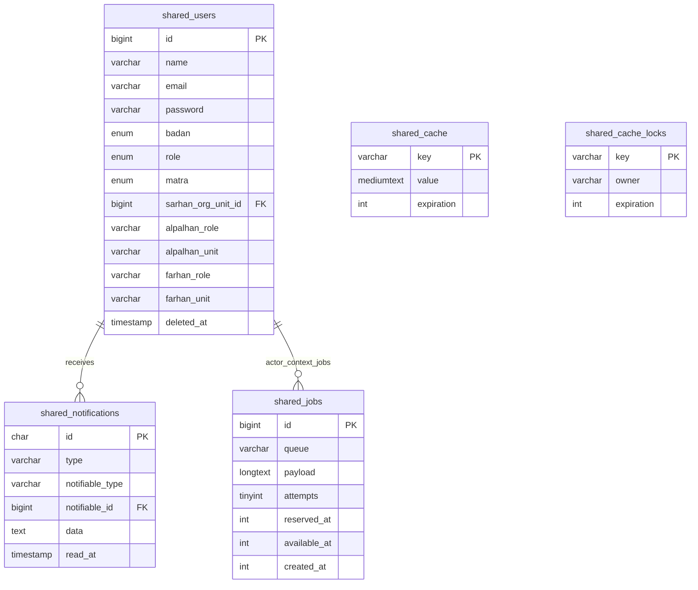

# Redesain ERD & Normalisasi — Tabel Bersama (Shared/Core)

Dokumen ini mendefinisikan hasil redesain dan normalisasi tabel bersama (*shared/core tables*) untuk mendukung otentikasi tunggal (single gate auth) lintas domain dan infrastruktur pendukung aplikasi.

---

## 1. Diagram ERD (Mermaid)

---

## 2. Redesain Skema Tabel (shared_*)

### `shared_users`
Pintu gerbang autentikasi tunggal dan informasi otorisasi pengguna lintas domain (AL, SH, FH).
* **Kunci Utama:** `id` `bigint` (Auto Increment)
* **Kolom:**
  * `id` `bigint` NOT NULL AUTO_INCREMENT (PK)
  * `name` `varchar(255)` NOT NULL
  * `email` `varchar(255)` NOT NULL (Unique)
  * `password` `varchar(255)` NOT NULL
  * `badan` `enum('SuperAdmin','Alpalhankam','Farhan','Sarhan')` NOT NULL
  * `role` `enum('operator','mabes','kotama','pusat')` NULL
  * `matra` `enum('AD','AU','AL')` NULL
  * `sarhan_org_unit_id` `bigint` NULL (FK ke `sar_org_units.id`)
  * `alpalhan_role` `varchar(255)` NULL
  * `alpalhan_unit` `varchar(255)` NULL
  * `farhan_role` `varchar(255)` NULL
  * `farhan_unit` `varchar(255)` NULL
  * `email_verified_at` `timestamp` NULL
  * `remember_token` `varchar(100)` NULL
  * `created_at` `timestamp` NULL
  * `updated_at` `timestamp` NULL
  * `deleted_at` `timestamp` NULL *(Mendukung Soft Delete)*
* **Indeks & Normalisasi:**
  * `UNIQUE INDEX shared_users_email_uq (email)` (Menjamin keunikan alamat email untuk kredensial login).
  * `INDEX (sarhan_org_unit_id)` (Indeks kolom foreign key).

### `shared_notifications`
Penyimpanan notifikasi sistem terpusat untuk pengguna.
* **Kunci Utama:** `id` `char(36)` (UUID)
* **Kolom:**
  * `id` `char(36)` NOT NULL (PK)
  * `type` `varchar(255)` NOT NULL
  * `notifiable_type` `varchar(255)` NOT NULL
  * `notifiable_id` `bigint` NOT NULL (FK ke `shared_users.id` ON DELETE CASCADE)
  * `data` `text` NOT NULL (JSON stringified payload)
  * `read_at` `timestamp` NULL
  * `created_at` `timestamp` NULL
  * `updated_at` `timestamp` NULL
* **Indeks & Normalisasi:**
  * `INDEX shared_notifications_notifiable_read_idx (notifiable_id, read_at)` (Composite index untuk mempercepat pencarian daftar notifikasi yang belum dibaca per user).

### `shared_cache`
Penyimpanan cache persisten berbasis database.
* **Kunci Utama:** `key` `varchar(255)`
* **Kolom:**
  * `key` `varchar(255)` NOT NULL (PK)
  * `value` `mediumtext` NOT NULL
  * `expiration` `int` NOT NULL
* **Indeks & Normalisasi:**
  * `INDEX shared_cache_expiration_idx (expiration)` (Mempermudah pembersihan berkala data cache kedaluwarsa).

### `shared_cache_locks`
Mekanisme penguncian transaksi terdistribusi (*distributed locks*).
* **Kunci Utama:** `key` `varchar(255)`
* **Kolom:**
  * `key` `varchar(255)` NOT NULL (PK)
  * `owner` `varchar(255)` NOT NULL
  * `expiration` `int` NOT NULL

### `shared_jobs`
Antrean tugas latar belakang (*background jobs*) persisten.
* **Kunci Utama:** `id` `bigint` (Auto Increment)
* **Kolom:**
  * `id` `bigint` NOT NULL AUTO_INCREMENT (PK)
  * `queue` `varchar(255)` NOT NULL
  * `payload` `longtext` NOT NULL
  * `attempts` `tinyint` NOT NULL DEFAULT 0
  * `reserved_at` `int` NULL
  * `available_at` `int` NOT NULL
  * `created_at` `int` NOT NULL
* **Indeks & Normalisasi:**
  * `INDEX shared_jobs_queue_available_idx (queue, available_at)` (Composite index untuk mempermudah worker mengambil tugas antrean yang siap diproses).
